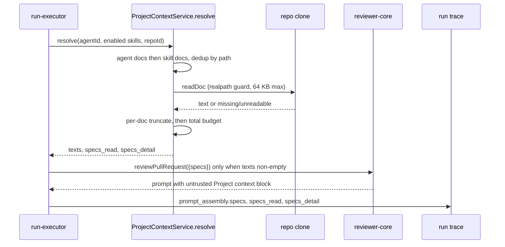

# Project Context module

Server side of the cross-module feature specified in
[specs/project-context.md](../../specs/project-context.md). The module
(`src/modules/project-context/`) lets a user attach repo markdown docs to an
agent or skill, and resolves them into the review prompt at run time. Docs are
view-only: no route writes to the repo clone.

## Routes

| Route | Purpose |
|---|---|
| `GET /repos/:repoId/context/docs` | list candidate `.md` docs (`path`, `root_type`, `size_bytes`, `tokens`, `used_by`), sorted by path |
| `GET /repos/:repoId/context/docs/content?path=` | one doc's text and token count |
| `GET /agents/:id/context?repo_id=` / `GET /skills/:id/context?repo_id=` | ordered attachments with `status` `ok`/`missing` and `tokens` |
| `PUT /agents/:id/context` / `PUT /skills/:id/context` | replace the owner's attachments for one repo; body `{repo_id, paths}` |

Query and body are `safeParse`d inside the handlers, so validation failures
answer 400 (schema-driven validation would answer 422). Validation runs before
`getContext`. Unknown or cross-workspace repo/agent/skill answers 404. A
missing doc on the content endpoint answers 404; a non-text file answers 422
`unreadable`.

## Path guard

`validateDocPath` (pure, `helpers.ts`) accepts a path only if it is a string up
to 1024 chars, has no NUL or backslash, is not absolute or drive-prefixed, has
no empty/`.`/`..` segment, ends in `.md`, and has a directory segment equal to
`specs`, `docs` or `insights`. Anything else is 400 `invalid_path`.

`readDoc` (service) adds filesystem checks evaluated at read time:

- `realpath` of the file must stay inside the clone's real root; the real
  relative path must itself pass `validateDocPath` and not contain `.git`. A
  symlink escape is therefore `invalid_path` (400 on the content endpoint).
- the file is opened with `O_NOFOLLOW` and its dev/inode compared to the
  pre-open `lstat` (guards a swap between check and read).
- at most 64 KB is read; binary content (NUL byte) is `unreadable`.

Listing walks the clone, skipping symlinks and `IGNORE_DIRS` (`.git`,
`node_modules`, `dist`, `build`, `coverage`, `.next`, `out`, `vendor`). A
missing clone directory returns an empty list with `reason: "not_cloned"`.

`PUT` rejects the whole request with 400 `invalid_path` if any path is invalid,
any path is duplicated, or more than the list cap is sent; stored rows are kept.
An empty `paths` clears the owner's attachments for that repo.

## Caps (`constants.ts`)

| Constant | Value |
|---|---|
| per-doc tokens | 4000 |
| total tokens | 10000 |
| listed files | 500 |
| bytes read per file | 64 KB |
| read concurrency | 8 |

Tokens come from `container.tokenizer`, the same counter run logs use.

## Resolve order and budget

`ProjectContextService.resolve` (exposed on the container as
`projectContext`; the routes use the same single container-owned
`projectContextService`) is called by `run-executor` and never imports back
into `reviews`.

1. Agent's attachments for the PR repo, by position; then each enabled skill's
   (agent_skills order), by position.
2. Dedup by path, first occurrence wins (so agent docs beat skill docs).
3. Read each doc. Missing -> `missing`; invalid/unreadable -> `unreadable`; an
   info log line `project-context doc skipped` (path, status, source, no text)
   is written per skipped doc.
4. Per-doc cap: keep the head and append `\n\n[truncated]`; the marker is
   counted inside the cap. A file cut at the 64 KB read limit is also marked
   `truncated`.
5. `applyBudget` adds docs in order while the running total stays within 10000
   tokens; a doc that does not fit is `over_budget` (its own token count is
   recorded), though a smaller later doc may still fit.
6. Any throw is caught, logged as a warning, and the run proceeds with empty
   context.

## Run-time flow

## Trace fields

- `prompt_assembly.specs` — the injected text (null when nothing injected).
- `specs_read` — paths that were injected (`read` and `truncated`).
- `specs_detail` (nullish; omitted when empty) — per doc `{path, tokens,
  source: agent|skill, source_name, status: read|truncated|missing|unreadable|over_budget}`.

When nothing resolves, `specs` is not passed to reviewer-core and the prompt is
unchanged.

## Known gaps

- AC-3 (configurable roots/glob) is deferred; roots are a constant.
- `GET .../context` reports `status: "ok"` with `tokens: 0` for an attachment
  that is present but invalid/unreadable (only `missing` is distinguished),
  whereas the run trace records it as `unreadable`.
