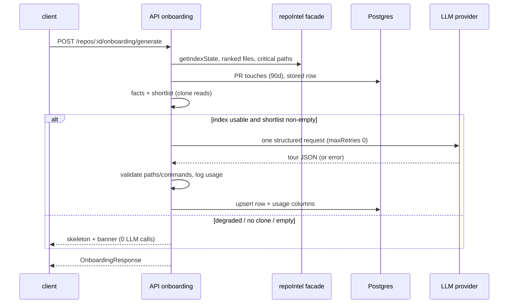

# Spec — Onboarding Generator (Onboarding Tour page)

Status: **approved** (2026-10-04) · Scope: `server/` + `client/` (contracts in both `@devdigest/shared` copies) · Location: `specs/onboarding-generator.md`

## 1. Summary

A per-repo "Onboarding Tour" page that turns the repo-intel index plus deterministic facts into five sections with **exactly one** structured LLM call. When the index is degraded, the repo is not cloned, or the LLM fails, the page shows a deterministic skeleton with an honest status banner. No second paid call is ever made automatically.

| Surface | Where | What |
|---|---|---|
| Onboarding Tour page | `/repos/[repoId]/onboarding-tour` | header, "ON THIS PAGE" TOC, five collapsible cards, banner, cost/stale chips |
| Sidebar item | WORKSPACE, between Pull Requests and Project Context | link to the page |
| `GET /repos/:id/onboarding` | server | stored tour or deterministic skeleton + index/usage metadata |
| `POST /repos/:id/onboarding/generate` | server | the single paid generation (Generate / Regenerate / Retry) |

Sections, in order: Architecture overview · Critical paths · How to run locally · Guided reading path · First tasks.

## 2. Current state

- No onboarding module, route or endpoint exists on the server (grep of `server/src` outside `vendor/` and migrations finds only the pieces below).
- Table `onboarding` (`repo_id` PK → repos cascade, `json jsonb`, `generated_at`) — `server/src/db/schema/context.ts:120-126`. Applied in `0000_init.sql:205`.
- Contract `Onboarding {sections: OnboardingSection[]}` with generic `{kind, title, body, diagram, links}` — `server/src/vendor/shared/contracts/knowledge.ts:28-47` (client copy at the same path; no other consumer found).
- Prompt `server/src/prompts/onboarding.system.md` targets the old section set (`architecture`, `routes_and_apis`); client `messages/en/onboarding.json` describes the old five (overview, architecture, key modules, getting started, conventions).
- Feature-model entry `onboarding` / "Onboarding Tour" exists (`contracts/platform.ts:46`), resolved with `resolveFeatureModel` (`modules/settings/feature-models.ts:51`).
- repo-intel facade: `getTopFilesByRank`, `getCriticalPaths`, `getRepoMap`, `getIndexState` (`modules/repo-intel/types.ts:137-172`). `getCriticalPaths` returns greedy chains from the top 5 ranked files (`service.ts:663-702`); junk paths (tests/configs/migrations) are filtered (`service.ts:713-733`). `getFileRank` exposes percentiles only (`types.ts:119-122`), not raw PageRank.
- Rank = PageRank only; hotness is hard-coded 0 (`pipeline/full.ts:18,227,262`). Index cap `MAX_INDEXED_FILES = 5000`, `MAX_FILE_SIZE = 400 KB` (`constants.ts:42-43`). `IndexResult` has `filesIndexed`, `filesSkipped`; `IndexState` adds `lastIndexedSha`, `degraded`, `degradedReason` (`types.ts:34-50`).
- `file_facts` holds endpoints/crons per file (`repository.ts:98`); nothing collects stack, scripts, env keys or compose services.
- Imported PR data: `pull_requests.opened_at`, `pr_files.path` (`db/schema/pulls.ts:27,36-45`). `pr_files` is filled only when a PR is first opened in the UI (server INSIGHTS 2026-10-01) — hotness undercounts for never-viewed PRs.
- GitHub adapter exposes only PR/issue operations (`adapters/github/octokit.ts:36-369`) — **no README or tree read**. So the no-clone fallback is an empty state, not README text.
- `completeStructured` retries up to `maxRetries ?? 2` extra requests (`reviewer-core/src/llm/openrouter.ts:61`) and returns `tokensIn`, `tokensOut`, `costUsd`, `attempts` (`:105-109`). Conventions is the precedent for a system feature (`modules/conventions/service.ts:63-109`: bail before the model call when the sample is empty; return `cost_usd`).
- Client: `activeKeyFor` maps any path containing `/onboarding` to `"onboarding-tour"` (`components/app-shell/helpers.ts:29`) — this also matches the add-repo route `/onboarding`. Label `shell.json:19` exists. `client/src/vendor/ui/nav.ts:25-27` WORKSPACE has no Onboarding item.

## 3. Goals / Non-goals

Goals: (G1) five typed sections on one page; (G2) deterministic facts and ranking; (G3) one LLM call, cost/calls observable in logs, DB and UI; (G4) honest degraded behaviour; (G5) grounded output (no invented paths/commands).

Non-goals: public share endpoint; auto-generation or auto-regeneration; per-package monorepo tours; git-history churn / indexer changes; README or tree fetch via GitHub without a clone; non-English output; executing any command; persisted collapse state; MCP tools; editing the tour.

## 4. Users & UX flow

Actor: a developer opening an unfamiliar repo already imported into DevDigest. Entry: sidebar "Onboarding Tour".

Flow: open page → `GET` → (a) stored tour shown, or (b) skeleton + banner "not generated yet", or (c) empty state when not cloned → user clicks **Generate** (or **Regenerate**) → one `POST` → tour replaces skeleton; header shows cost chip.

| State | Trigger | User sees |
|---|---|---|
| Loading | `GET` pending | skeleton cards (5) + TOC |
| Generated | stored current-version tour | cards, header "indexed X of Y files · refreshed <relative>", cost chip |
| Stale | `generated_sha` ≠ `last_indexed_sha` | "Stale" chip next to refreshed time; no auto-regenerate |
| Skeleton, not generated | no stored tour, index usable | skeleton cards + banner "Not generated yet" + Generate |
| Skeleton, degraded | index `degraded`/`failed` | skeleton + banner "Index degraded (<reason>)" + Retry |
| Skeleton, LLM failed | LLM error/timeout | skeleton or last stored tour + banner "Generation failed" + Retry |
| Skeleton, invalid output | schema validation failed | same + banner "Model output was invalid" + Retry |
| Empty | repo not cloned | empty state + CTA "Index repository" (calls existing `POST /repos/:id/resync`) |
| Regenerating | POST pending | button disabled, "Regenerating…", old content kept |
| Load error | `GET` fails | error card + Retry (`loadError.title` exists) |

Design sources: two dark-UI screenshots described in the request (page layout, TOC, header, cards, copy and Open buttons); the Architecture card shows paragraph + box diagram; the First tasks card was not visible.

## 5. Design analysis

Gaps (all resolved in §6/§9): loading/empty/error/banner states; target of "Open"; collapse default; First tasks row layout; header "12,450 files" vs cap 5000; copy for banners (§9 AC-35, `onboarding.json`).
Uncovered edge cases: not cloned; partial index; graph with no edges; no PRs (hotness 0); concurrent Regenerate; model returns unknown paths/commands; prompt injection in README/scripts; secrets in `.env.example`; symlinked clone files (server INSIGHTS 2026-10-04); repo deleted mid-generation; NULL cost.
Module interaction: see §8.
UX improvements: P1 status banner **accepted** (required); P2 cost chip **accepted**; P3 skeleton loaders **accepted**; P4 score badge **accepted** (lightly, `score` field); P5 stale chip **accepted**; P6 persisted collapse state **rejected by user**.

## 6. Decisions

| # | Decision | Rationale | Source |
|---|---|---|---|
| D1 | The five new sections replace the old set; old prompt and `onboarding.json` are rewritten | one coherent product definition | user Q1 |
| D2 | Typed per-section contract + `version`; legacy rows (fail to parse as v2) are ignored and overwritten on next generation | structured rows feed Open/copy buttons and are checkable | user Q2 |
| D3 | `hotness` = percentile ∈ [0,1] of `log1p(PR touches)` over PRs with `opened_at` in the last 90 days, counted from `pr_files`; 0 when no PRs. `score = pr_norm × (1 + hotness)`, `pr_norm` = PageRank / max PageRank | no clone/indexer change; bounded hotness never zeroes a central file | user Q3, R1 |
| D4 | Index cap unchanged. LLM input: top K = 30 files by score + token-capped facts bundle; file bodies only for README and manifests (heads, truncated) | large-repo bound | user Q4, R2 |
| D5 | Exactly one structured request: `maxRetries: 0`; failures never trigger an automatic second call | "one call" promise | user Q5, `openrouter.ts:61` |
| D6 | Usage persisted on the `onboarding` row as **nullable** new columns (`model`, `tokens_in`, `tokens_out`, `cost_usd`, `llm_calls`, `duration_ms`, `generated_sha`) via a generated migration; a log line is emitted at the same time | persist, don't recompute (run-cost precedent); NOT NULL without default would fail on non-empty tables (server INSIGHTS 2026-09-22) | user Q5, `run-cost.md` D1 |
| D7 | Skeleton is computed on read, never stored | nothing to go stale | user Q6 |
| D8 | Without a clone: empty state + CTA to index (adapter has no README/tree read) | verified in code | user Q6, `octokit.ts` |
| D9 | Facts collection (stack, scripts, env keys, compose services, routes) is owned by the new `modules/onboarding/`; reads go through the repoIntel facade and safe clone reads. A new **read-only** facade method may be added for raw ranked files (`getFileRank` gives percentiles only); the pipeline is not modified | ownership | user minor defaults, `types.ts:119-149` |
| D10 | Single-flight per repo: a concurrent `POST generate` joins the in-flight run and gets its result | one paid call per click burst | user Q7 |
| D11 | Failed regeneration keeps the previously stored tour; response carries a banner | no data loss | spec default |
| D12 | Route `/repos/[repoId]/onboarding-tour`; `activeKeyFor` fixed so `/onboarding` (add-repo) no longer selects the item | collision `helpers.ts:29` | user minor defaults |
| D13 | Sidebar item added through the vendored UI nav extension point; planner picks the mechanism, no edits to layer files | `client/CLAUDE.md` | user minor defaults |
| D14 | "Open" = `https://github.com/<full_name>/blob/<last_indexed_sha>/<path>`, new tab; Share link copies the in-app URL; copy buttons only copy | no public surface, no execution | user Q7 |
| D15 | Spec-default thresholds: input ≤ 12,000 tokens, output ≤ 4,000 tokens, LLM timeout 60 s, `GET` p95 ≤ 1 s | numeric NFRs need numbers | spec default (editable at approval) |
| D16 | Skeleton content: architecture = templated markdown (stack + top-level dirs) no diagram; critical paths = chains from `getCriticalPaths` with templated reasons; run steps = verified commands; reading path = scored list with templated `why`; first tasks = raw candidates labelled as such | honest, no prose invented | user Q6 |

## 7. Data model & contracts

DB (`server/src/db/schema/context.ts`, migration generated by `pnpm --dir server db:generate`, never hand-written): add nullable `model text`, `tokens_in int`, `tokens_out int`, `cost_usd double precision`, `llm_calls int`, `duration_ms int`, `generated_sha text` to `onboarding`. No backfill; legacy rows are ignored (D2). `NULL cost_usd` renders "—".

`@devdigest/shared` (server **and** client copy; diff the two first): replace `OnboardingLink`/`OnboardingSection`/`Onboarding` (`knowledge.ts:28-47`) with:

- `OnboardingTour` = `{ version: 2, architecture: {summary_md: string, diagram: string|null}, critical_paths: {path, reason}[], run_steps: {command, note}[], reading_path: {path, why, score: number}[], first_tasks: {title, why, files: string[]}[] }`.
- `OnboardingResponse` (wire, snake_case) = `{ tour: OnboardingTour|null, source: 'llm'|'skeleton'|'none', banner: null | {kind: 'not_generated'|'index_degraded'|'no_clone'|'llm_failed'|'invalid_output', reason: string|null}, index: {status, files_indexed, files_total, last_indexed_sha: string|null}, generated_at: string|null, generated_sha: string|null, stale: boolean, usage: {model, tokens_in, tokens_out, cost_usd: number|null, llm_calls, duration_ms}|null }`. `files_total` = `filesIndexed + filesSkipped` (`types.ts:34-40`).
- The LLM output schema is a server-internal subset (architecture, per-path `reason`/`why`, `run_steps`, `first_tasks`); order and `score` of the reading path are computed server-side.

Collected command set (for validation): install command by lockfile, `package.json` scripts, `docker compose up -d <service>` per compose service, `cp .env.example .env` when that file exists. `.env.example` yields keys only.

## 8. Module interaction

- **client** → `GET`/`POST` above (React Query hook in `src/lib/hooks/`); renders, copies, opens links. Computes nothing about ranking.
- **server `modules/onboarding/`** (routes · service · helpers · constants · repository): validates input, then resolves workspace (`getContext` after `safeParse`, server INSIGHTS 2026-10-04), reads index via `repoIntel.*`, reads PR touches, reads allowed clone files, builds facts + skeleton, makes the one LLM call through `container.llm(provider).completeStructured` with `resolveFeatureModel(…, 'onboarding')`, post-validates, persists, logs.
- **reviewer-core**: `OpenRouterProvider` (and the server OpenAI/Anthropic adapters) must send a single HTTP request and honour `timeoutMs` when `maxRetries: 0`; default behaviour unchanged (plan T3).
- **mcp / e2e**: mcp out of scope; e2e covers skeleton/empty states only (no LLM).

Failure propagation: LLM error/timeout/validation failure → HTTP 200 with skeleton (or last stored tour) and a banner; nothing is persisted; no retry call. Unknown repo → 404.

## 9. Acceptance criteria (EARS)

| ID | Pattern | Requirement | Cat |
|---|---|---|---|
| AC-1 | Event | When `GET /repos/:id/onboarding` is called and a stored row parses as `OnboardingTour` version 2, the API shall return it with `source: 'llm'`. | C3 |
| AC-2 | Unwanted | If the stored row does not parse as version 2, then the API shall treat the repo as having no stored tour. | C3 |
| AC-3 | Event | When `GET` is called, no stored tour exists, the repo is cloned and the index is not `degraded`/`failed`, the API shall return a deterministic skeleton with `source: 'skeleton'`, banner `not_generated` and zero LLM calls. | C5 |
| AC-4 | Unwanted | If the repo has no clone and no stored tour, then the API shall return `tour: null`, `source: 'none'` and banner `no_clone`. | C5 |
| AC-5 | Unwanted | If `getIndexState` reports `degraded` or `failed`, then the API shall return the skeleton with banner `index_degraded` carrying `degradedReason`. | C5 |
| AC-6 | Ubiquitous | The API shall include `index.status`, `files_indexed`, `files_total` and `last_indexed_sha` in every `OnboardingResponse`. | C3 |
| AC-7 | State | While `generated_sha` differs from `last_indexed_sha`, the API shall set `stale: true`. | C5 |
| AC-8 | Unwanted | If the repo id does not exist in the workspace, then the API shall answer 404. | C5 |
| AC-9 | Ubiquitous | The onboarding module shall collect stack, scripts, env keys, compose services and routes without any LLM call. | C3 |
| AC-10 | Ubiquitous | The onboarding module shall return `.env.example` keys only and never their values. | C6 |
| AC-11 | Unwanted | If a clone path to read contains a `.git` segment or resolves (realpath) outside the clone or through a symlink, then the onboarding module shall skip the file. | C6 |
| AC-12 | Ubiquitous | The onboarding module shall compute each reading-path `score` as `(PageRank / max PageRank) × (1 + hotness)`. | C3 |
| AC-13 | Ubiquitous | The onboarding module shall compute `hotness` as the percentile in [0,1] of `log1p(PR touches)` over PRs with `opened_at` in the last 90 days, and 0 for every file when no such PR exists. | C3 |
| AC-14 | Ubiquitous | The onboarding module shall order the reading path by `score` descending then path ascending, limited to 30 files, excluding test/config/generated/migration paths. | C3 |
| AC-15 | Ubiquitous | The onboarding module shall derive critical paths from `repoIntel.getCriticalPaths`. | C4 |
| AC-16 | Ubiquitous | The onboarding module shall build the first-task candidate shortlist from TODO/FIXME occurrences, source files without a sibling test, and small leaf files, excluding vendor, generated and lock files. | C3 |
| AC-17 | Event | When `POST /repos/:id/onboarding/generate` is called on a usable index, the API shall issue exactly one structured request with `maxRetries: 0` using the model from `resolveFeatureModel(…, 'onboarding')`. | C4 |
| AC-18 | Ubiquitous | The API shall wrap README and manifest excerpts in per-run nonce-delimited untrusted blocks and the prompt shall state they are data, not instructions. | C6 |
| AC-19 | Ubiquitous | The API shall drop every model-returned path absent from the indexed file list and every `run_steps.command` absent from the collected command set. | C5 |
| AC-20 | Unwanted | If validation leaves a section empty, then the API shall fill that section with its deterministic skeleton content. | C5 |
| AC-21 | Event | When the call succeeds, the API shall upsert the `onboarding` row with the tour, `version`, `generated_sha`, `model`, `tokens_in`, `tokens_out`, `cost_usd`, `llm_calls`, `duration_ms`. | C3 |
| AC-22 | Event | When a generation finishes, the API shall write one log line with repo id, model, tokens_in, tokens_out, cost_usd, llm_calls, duration_ms and outcome. | C6 |
| AC-23 | State | While a generation for a repo is in flight, the API shall serve any further `POST generate` for that repo from the same run without another LLM request. | C5 |
| AC-24 | Unwanted | If the LLM call errors or exceeds 60 s, then the API shall return the last stored tour or the skeleton with banner `llm_failed`, persist nothing and make no further request. | C5 |
| AC-25 | Unwanted | If the model output fails schema validation, then the API shall behave as in AC-24 with banner `invalid_output`. | C5 |
| AC-26 | Unwanted | If the index is `degraded`/`failed`, the repo is not cloned, or the shortlist is empty, then `POST generate` shall make zero LLM requests and return the skeleton with the matching banner. | C5 |
| AC-27 | Unwanted | If the repo is deleted before persistence, then the API shall not write a row. | C5 |
| AC-28 | Ubiquitous | The tour page shall render `summary_md`, `why`, `reason`, `note` as Markdown without raw HTML. | C6 |
| AC-29 | Ubiquitous | The tour page shall show the header "Onboarding for <repo name>", "indexed X of Y files" and the relative refresh time. | C2 |
| AC-30 | Ubiquitous | The tour page shall show five cards in the order architecture, critical paths, run locally, reading path, first tasks, all expanded on load, each collapsible with local state. | C2 |
| AC-31 | Ubiquitous | The tour page shall show an "ON THIS PAGE" TOC whose entries scroll to the five section anchors. | C2 |
| AC-32 | Event | When the user clicks "Open" on a path row, the tour page shall open the GitHub blob URL at `last_indexed_sha` in a new tab. | C2 |
| AC-33 | Event | When the user clicks a run-step copy button, the tour page shall copy that command to the clipboard and not execute it. | C2 |
| AC-34 | Event | When the user clicks "Share link", the tour page shall copy the current in-app URL to the clipboard. | C2 |
| AC-35 | State | While a banner is present, the tour page shall show its message from `onboarding.json` and a Retry (or Generate) button. | C2 |
| AC-36 | Event | When the user clicks Generate/Regenerate, the tour page shall send one `POST`; a second click before the first settles shall send none. | C5 |
| AC-37 | State | While the `POST` is pending, the tour page shall disable the button, show "Regenerating…" and keep the current content. | C2 |
| AC-38 | Unwanted | If the `POST` fails at HTTP level, then the tour page shall keep the current content and show an error banner with Retry. | C5 |
| AC-39 | State | While `usage` is present, the tour page shall show a chip with model, total tokens and cost, rendering a null cost as "—". | C6 |
| AC-40 | State | While `stale` is true, the tour page shall show a "Stale" chip and shall not regenerate automatically. | C2 |
| AC-41 | State | While `GET` is pending, the tour page shall show five skeleton cards and the TOC. | C2 |
| AC-42 | State | While the response has banner `no_clone`, the tour page shall show an empty state whose CTA calls `POST /repos/:id/resync`. | C2 |
| AC-43 | Unwanted | If `GET` fails, then the tour page shall show an error card with Retry. | C5 |
| AC-44 | Ubiquitous | The reading-path card shall show each row's path, `why` and `score` badge, numbered in order. | C2 |
| AC-45 | State | While `source` is `skeleton`, the first-tasks card shall list raw candidates labelled as unranked. | C2 |
| AC-46 | Unwanted | If a `diagram` fails to render, then the tour page shall omit the diagram and still show `summary_md`. | C5 |
| AC-47 | Ubiquitous | The sidebar shall list "Onboarding Tour" between Pull Requests and Project Context and mark it active only on `/repos/[repoId]/onboarding-tour`. | C2 |
| AC-48 | Ubiquitous | The tour page shall take all copy from `client/messages/en/onboarding.json`, and header controls shall be keyboard-focusable with accessible names. | C2 |

## 10. Non-functional requirements

| ID | Requirement | Measure / threshold |
|---|---|---|
| NFR-1 | When a generation runs, the API shall send exactly one LLM request. | `llm_calls` = 1 (mock provider counts 1) |
| NFR-2 | The API shall cap the prompt and completion. | input ≤ 12,000 tokens (tokenizer adapter); output ≤ 4,000 |
| NFR-3 | `GET /repos/:id/onboarding` shall respond quickly on an index of 5000 files. | p95 ≤ 1 s, no LLM call |
| NFR-4 | The API shall abort an LLM request that exceeds the timeout. | 60 s → AC-24 |
| NFR-5 | The API shall treat README/manifest/PR text as untrusted data and the client shall escape output. | AC-18, AC-28 |
| NFR-6 | The API shall never log or return secret values. | AC-10; token in clone `.git/config` unreachable (AC-11) |
| NFR-7 | The skeleton shall be deterministic. | same index + facts + PRs → byte-identical response (excluding timestamps) |
| NFR-8 | The migration shall be generated, additive and nullable. | `db:generate` output only; legacy rows ignored |

## 11. Traceability

| Req | Goal / Decision | Module | Likely files/areas | Verification |
|---|---|---|---|---|
| AC-1–8 | G4 · D2, D7, D8 | server | `modules/onboarding/{routes,service}.ts` | `*.it.test.ts` + hermetic route test |
| AC-9–11 | G2 · D9 | server | `modules/onboarding/helpers.ts` (safe read modelled on `modules/project-context/service.ts` `readDoc`) | unit |
| AC-12–16 | G2 · D3, D4 | server (+ read-only facade method) | `modules/onboarding/helpers.ts`, `modules/repo-intel/{types,service}.ts` | unit (pure) |
| AC-17–21, AC-23–27 | G3, G5 · D5, D6, D10, D11 | server | `modules/onboarding/service.ts`, `db/schema/context.ts`, `prompts/onboarding.system.md`, shared contracts | unit with mock `LLMProvider`; `.it.test.ts` |
| AC-22, NFR-1–4, 6–8 | G3 · D6, D15 | server | `service.ts`, logger | unit + `.it.test.ts` |
| AC-28–31, 35, 41, 43–46 | G1 · D2, D16 | client | `src/app/repos/[repoId]/onboarding-tour/_components/OnboardingTourView/`, `mermaid-diagram` | RTL |
| AC-32–34, 36–40, 42, 48 | G3, G4 · D12, D14 | client | same + `src/lib/hooks/onboarding.ts`, `messages/en/onboarding.json` | RTL |
| AC-47 | G1 · D12, D13 | client | `components/app-shell/helpers.ts`, nav extension | RTL/unit; e2e |
| NFR-5 | — | server+client | prompt, renderer | unit + RTL |

## 12. Verification hints

- Server pure rules (AC-9–16, 19, 20): vitest unit tests, `pnpm --dir server test`. Integration (AC-1–8, 21, 23–27): Testcontainers `*.it.test.ts`, `pnpm --dir server exec vitest run .it.test`; use a mock `openrouter` provider (server INSIGHTS 2026-09-23). Validate before `getContext` in hermetic route tests (INSIGHTS 2026-10-04).
- AC-17/NFR-1: mock provider asserts one request and `maxRetries: 0`; planner must also confirm the openai/anthropic adapters honour a no-retry request.
- Client (AC-28–48): RTL, `pnpm --dir client test`; double-click guard via `useRef` (client INSIGHTS 2026-09-22).
- e2e: new `e2e/flows/NN-onboarding-tour.flow.json` covering the empty/skeleton states only.
- Tests are named `it('AC-<n>: …')`.

## 13. Open questions

None. Every earlier question was answered by the user or resolved with the accepted defaults (§6).

## 14. Out of scope

Public share endpoint; auto-generate/regenerate; monorepo per-package tours; git-history churn; README/tree fetch without a clone; i18n beyond English; persisted collapse state (P6, rejected by user); MCP tools; cleanup of the legacy `onboarding.json` copy beyond its rewrite.

## 15. Changelog

| Date | Change | Reason / source |
|---|---|---|
| 2026-10-04 | Initial spec, status `clarified` | Pass 2 after user answers; R1/R2 research |
| 2026-10-04 | §8: reviewer-core/LLM adapters change for `maxRetries: 0` (single HTTP request) | Planner finding: SDK + `withRetry` retries break NFR-1; user approved |
