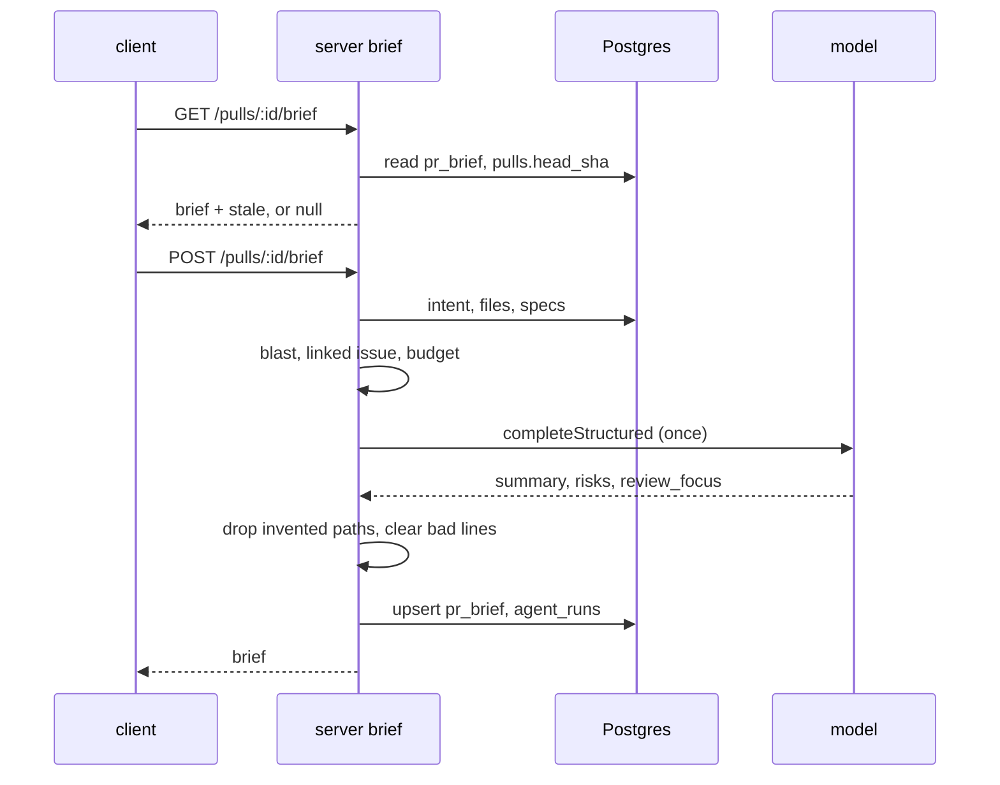

# Spec — PR Why + Risk Brief

Status: **approved** (2026-10-04) · Scope: `server/` + `client/` (contracts in both `@devdigest/shared` copies) · Location: `specs/pr-brief.md`

## 1. Summary

A reviewer opening a PR cold gets one **PR Brief** card on the PR Overview tab. It combines facts that already exist (Intent, Blast radius, Smart Diff roles) with one model-written part: a short summary, **Risk areas** (each tied to a file) and **Review focus** (files, optionally a line, in reading order). The model is called **exactly once** per generation, with `maxRetries: 0`, on already-computed facts only. It never sees diff hunk bodies. The result is cached in `pr_brief`; reloading shows it without a model call.

| Surface | Where | What |
|---|---|---|
| PR Brief card | `/repos/[repoId]/pulls/[number]` Overview tab | Generate button, summary, Risk areas, Review focus, missing-input chips, cost chip, stale notice, Refresh |
| Intent + Blast radius | same card, beside the model parts | existing `IntentCard` and `BlastRadius`, fetched live |
| Files changed tab | `?tab=diff&file=<path>` | target file's group expanded, card opened, scrolled to, highlighted |
| API | `GET` / `POST /pulls/:id/brief` | read cache / generate |

## 2. Current state

- Contract: `server/src/vendor/shared/contracts/brief.ts` has `Intent` (:33), `BlastRadius` (:89), `Risk` (:102), `Risks` (:111), `SmartDiff*` (:133-165) and `PrBrief{intent,blast,risks,history}` (:168), all four required. The client copy matches at the checked anchors; implementers must `diff` both files. No `summary`, `review_focus`, `head_sha` or cost fields exist. Nothing consumes `PrBrief` today.
- `pr_brief(pr_id pk → pull_requests cascade, json jsonb not null)` exists (`server/src/db/schema/reviews.ts:97`); nothing reads or writes it. Migrations 0006–0013 already contain it.
- Intent: `pr_intent` (`reviews.ts:60`), `getIntent` (`reviews/repository.ts:153` → `repository/pull.repo.ts:121`). `GET /pulls/:id/intent` returns 200 `null` if never derived (`reviews/routes.ts:174-178`). It is derived only by a review run or `POST /pulls/:id/intent`.
- Blast: `GET /pulls/:id/blast` (`modules/blast/routes.ts:18`), `BlastService.getBlast(workspaceId, prId)`. `summary` is a deterministic string (`blast/helpers.ts:32-49`); callers capped at `BLAST_CALLER_CAP=20` (`blast/constants.ts:8`); a missing or partial index is 200 with `degraded` + `reason`.
- Smart Diff roles are computed, not stored: `classifyFile(path)` (`reviews/helpers.ts:183`), roles `core|tests|wiring|docs|boilerplate`.
- `PrFile` has `path`, `additions`, `deletions`, `patch` (`platform.ts:209-213`); `pulls.headSha` (`db/schema/pulls.ts:20`).
- Project Context attachments belong to **agents/skills**, not PRs (`project-context/service.ts:259-297`, `repository.ts:60-66`, `agentContextDocs`). Limits: 4000 tokens/doc, 10000 total (`project-context/constants.ts:20-21`). `readDoc` (`service.ts:102`) does the safe read.
- `risk_brief` feature model exists (`platform.ts:18`), default `openai` / `gpt-4.1` (`platform.ts:60-64`); `resolveFeatureModel` at `settings/feature-models.ts:51`. Importing it into `platform/container.ts` is a circular dependency; use the route-thunk pattern (server INSIGHTS 2026-10-04; `modules/onboarding/routes.ts:27`).
- `completeStructured` usage: `reviews/intent-loader.ts:71-91`; returns `tokensIn/tokensOut/costUsd`. Linked-issue helpers `resolveLinkedIssueSignal` / `resolveLinkedContentSignal` are exported (`intent-loader.ts:140,164`).
- Client: `OverviewTab.tsx` renders `IntentCard` + `BlastRadius` in `s.briefGrid`; tab state is `?tab` (`page.tsx:60-68`, `router.replace`). `DiffTab` takes no file target; `FileCard` open state is internal (`FileCard.tsx:87`); `DiffViewer` collapses `docs` and `boilerplate` groups by default (`DiffViewer.tsx:34`).
- `client/messages/en/brief.json` has `block.*`, `noRisks`, `unavailable`, `unavailableHint`, `intentCard.*`; no keys for summary, review focus, generate, refresh, stale, missing inputs. `unavailableHint` ("Run a review or open the PR to compute it") is wrong for the new flow.

## 3. Goals / Non-goals

**Goals**: one-click brief on Overview; one model call; no invented paths or lines; cache survives reload; honest about missing inputs and stale state; click-through to the file in Files changed.

**Non-goals** (P3, not in this spec): verdict banner and PR score from the latest review, expandable risk explanations, "Prior PRs touching these files" (`history`). No automatic intent derivation or blast indexing at generate time. No automatic regeneration. No reading of diff hunk bodies by the model. No new migration.

## 4. Users & UX flow

Actor: a reviewer opening a PR. Flow: Overview → no brief → **Generate brief** → skeleton → card renders → click a Review focus item → `router.push` to `?tab=diff&file=<path>` → Files changed shows the file expanded and highlighted. Reload shows the cached brief. **Refresh** regenerates.

| State | Trigger | What the user sees |
|---|---|---|
| No brief | `GET` → `null` | card with Generate brief button; existing Intent/Blast blocks still shown |
| Generating | POST in flight | skeleton in the card, buttons disabled |
| Ready | cached or fresh brief | summary, Risk areas, Review focus, missing-input chips, cost chip |
| Stale | `stale: true` | brief plus notice "PR changed since this was generated" and Refresh |
| No risks | `risks: []` | `noRisks` copy; summary and focus still shown |
| No focus | `review_focus: []` | short empty line in the Review focus section |
| Error | POST fails | inline error with retry; any previous brief stays visible |
| Not clickable | risk file only in blast, not in diff | file shown as plain text |

Design sources: the request text and two described screenshots (Overview card; Files changed after click). They show no empty, loading, error, stale or missing-input states; those are defined above.

## 5. Design analysis

- **Gaps**: loading/error/stale/missing copy; behaviour when blast is `degraded`; keyboard/a11y for focus items; deep-link mechanics.
- **Uncovered edge cases**: see §9 (AC-9 to AC-19).
- **Module interaction**: §8.
- **UX improvements**: skeleton while generating — accepted. Missing-input chips — accepted. Stale brief shown with notice, not hidden — accepted. `?file=` in the URL via `router.push`, so Back returns to Overview — accepted. Severity colour plus text label — accepted. Cost chip — accepted. Verdict banner / score — rejected for this spec (P3).

## 6. Decisions

| # | Decision | Rationale | Source |
|---|---|---|---|
| D1 | Attached specs = union of docs attached to all **enabled agents** of the repo, deduped, via a new `project-context` method | PRs have no attachments; reuses safe read and budget code | user Q1=A |
| D2 | `GET` returns the cached brief with `stale: true` when `head_sha` differs from `pulls.headSha`; no auto-regeneration | avoids a paid call on every open | user Q2=A |
| D3 | `PrBrief` is redefined; intent and blast are NOT stored, the UI fetches them live; `history` is dropped; `Risk.file_refs` stay bare paths | no stale duplicates; "exactly once" stays clean | default Q3=A |
| D4 | Model sees new-side hunk ranges (from `@@` headers, no bodies); a `line` outside the file's ranges is cleared, the item becomes file-level | line can never be invented | user Q4=B |
| D5 | Generate never derives intent or indexes; missing inputs go in `missing_inputs` | one model call | default Q5=A |
| D6 | Risks may cite PR files ∪ blast changed-symbol and caller files; `review_focus` may cite PR files only | every focus item is clickable | default Q6=A |
| D7 | Input budget 8,000 tokens for the user message (system prompt and schema excluded), counted with `container.tokenizer.count` | bounded cost | user Q7=A |
| D8 | Write an `agent_runs` row (`agentId: null`) for cost, as `intent-loader.ts:63` does | cost accounting parity | default |
| D9 | `POST` rate limit 10/min plus single-flight per PR; `maxRetries: 0`; `GET` with no brief is 200 `null` | cost and double-click safety | default |
| D10 | Model chosen via `resolveFeatureModel(…, 'risk_brief')` in the route, passed to the service as a thunk | avoids circular import | server INSIGHTS 2026-10-04 |

## 7. Data model & contracts

- **DB**: none. `pr_brief.json` stores the new `PrBrief`; no migration.
- **`@devdigest/shared` `contracts/brief.ts`, both copies**: replace `PrBrief` with
  `{ summary: string (max 600 chars), risks: Risk[] (max 6), review_focus: ReviewFocusItem[] (max 8), head_sha: string, generated_at: string, model: string, tokens_in: int, tokens_out: int, cost_usd: number | null, missing_inputs: MissingInput[] }`.
  `ReviewFocusItem = { file: string, line: int | null, reason: string }` (line nullable, not omitted). `MissingInput` = `'intent' | 'blast' | 'linked_issue' | 'specs' | 'description'`, plus a `degraded_blast` marker when blast is `degraded` (blast reason is read live). `Risk` and `Risks` are unchanged; `history` is removed from `PrBrief` (`PrHistory` types stay). The model-facing schema is `{summary, risks, review_focus}` only; the server adds the rest.
- **Wire**: `GET /pulls/:id/brief` → `(PrBrief & { stale: boolean }) | null`; `POST /pulls/:id/brief` → `PrBrief & { stale: false }`. Snake_case, as the contract.
- **Input provenance** (all assembled by the server):

| Input | Source | Cap (tokens) |
|---|---|---|
| PR title, description | `pulls` row | 1,000 |
| Intent | `getIntent(prId)` (DB, no derivation) | 500 |
| Linked issue | `resolveLinkedIssueSignal` (GitHub; fail → missing) | 800 |
| Blast summary + ≤20 callers | `BlastService.getBlast` | 1,000 |
| Diff stats: `path · role · +a/−d · hunk ranges`, ≤150 files by churn | `getPrFiles`, `classifyFile`, `@@` headers | 1,700 |
| Attached specs | new `project-context` method (D1); ≤1,500 per doc | 3,000 |

  Total ≤ 8,000. Trim order when over: specs, then least-churn diff files, then description tail. Trimmed text is marked `[truncated]` and omitted files/docs are counted in the prompt.

## 8. Module interaction

- **server `modules/brief/`** (routes · service · helpers · constants · repository): assembles input, makes the one call, post-validates, caches, logs. The route resolves the model and passes a thunk. It calls `BlastService`, the reviews repository (`getIntent`, `getPrFiles`, `getPull`), `classifyFile`, the intent-loader linked-issue helper, and the new project-context method.
- **server `modules/project-context/`**: new method returning capped, deduped docs from all enabled agents' attachments for a repo; fail-soft like `resolve`.
- **client**: `GET`/`POST` hooks; PR Brief card in `OverviewTab`; `DiffTab` + `diff-viewer` read `?file=`.
- **reviewer-core**: not touched.
- Failure propagation: provider or Zod failure → API error, cache untouched → card shows error and keeps any previous brief.

## 9. Acceptance criteria (EARS)

| ID | Pattern | Requirement | Cat |
|---|---|---|---|
| AC-1 | Event | When `GET /pulls/:id/brief` is called for a PR with a cached brief, the API shall return it with `stale` set to whether its `head_sha` differs from `pulls.headSha`, without calling the model. | C1 |
| AC-2 | Event | When `GET /pulls/:id/brief` is called for a PR without a brief, the API shall return 200 with `null`. | C1 |
| AC-3 | Unwanted | If the PR id does not exist, then the API shall return 404 for `GET` and `POST /pulls/:id/brief`. | C5 |
| AC-4 | Event | When `POST /pulls/:id/brief` is called, the API shall make exactly one `completeStructured` request with `maxRetries: 0` using the model from `resolveFeatureModel(…, 'risk_brief')`. | C4 |
| AC-5 | Ubiquitous | The brief generator shall build the model input only from title, description, stored intent, linked issue, blast summary and callers, per-file stats with hunk ranges, and attached specs, and shall not include hunk bodies. | C1 |
| AC-6 | Ubiquitous | The brief generator shall keep the user message at or below 8,000 tokens counted with `container.tokenizer.count`, trimming in the order specs, least-churn diff files, description tail. | C6 |
| AC-7 | Ubiquitous | The brief generator shall cap each input at the §7 per-section token limit and mark cut text `[truncated]`. | C6 |
| AC-8 | Event | When a brief is generated, the API shall store it in `pr_brief` with `head_sha`, `generated_at`, `model`, `tokens_in`, `tokens_out`, `cost_usd` and `missing_inputs`, and write an `agent_runs` row. | C3 |
| AC-9 | Unwanted | If a risk cites no allowed file (PR files ∪ blast files after path normalisation), then the API shall drop that risk. | C5 |
| AC-10 | Unwanted | If a review-focus item cites a file that is not a PR file, then the API shall drop that item. | C5 |
| AC-11 | Unwanted | If a review-focus `line` is outside every new-side hunk range of its file, then the API shall set `line` to `null` and keep the item. | C5 |
| AC-12 | Event | When post-validation leaves zero risks or zero focus items, the API shall still return and cache the brief. | C5 |
| AC-13 | Unwanted | If intent is absent, then the API shall still generate and include `intent` in `missing_inputs`, without deriving intent. | C5 |
| AC-14 | Unwanted | If blast is `degraded` or fails, then the API shall still generate and report blast as missing in `missing_inputs`. | C5 |
| AC-15 | Unwanted | If the linked issue, attached specs or description are absent or unfetchable, then the API shall still generate and list them in `missing_inputs`. | C5 |
| AC-16 | Unwanted | If the model call or Zod validation fails, then the API shall return an error and leave any cached brief unchanged. | C5 |
| AC-17 | Unwanted | While a generation for a PR is in flight, the API shall reject or join a second `POST` for the same PR instead of making a second model call. | C5 |
| AC-18 | Ubiquitous | The API shall rate-limit `POST /pulls/:id/brief` to 10 requests per minute. | C6 |
| AC-19 | Ubiquitous | The brief generator shall treat PR description, linked issue and spec text as untrusted data in the prompt, and the PR Brief card shall render model output as plain text. | C6 |
| AC-20 | Ubiquitous | The attached-specs method shall return the deduped union of docs attached to enabled agents of the repo and shall return an empty result, not throw, on any internal error. | C4 |
| AC-21 | State | While no brief exists, the PR Brief card shall show a Generate brief button, and Intent and Blast radius blocks shall still render. | C2 |
| AC-22 | Event | When Generate or Refresh is clicked, the PR Brief card shall call `POST` and show a skeleton until it settles. | C2 |
| AC-23 | Unwanted | If the `POST` fails, then the PR Brief card shall show an error with retry and keep any previous brief visible. | C2 |
| AC-24 | State | While `stale` is true, the PR Brief card shall show a "PR changed since this was generated" notice and a Refresh button, and shall not regenerate automatically. | C2 |
| AC-25 | Ubiquitous | The PR Brief card shall show summary, Risk areas (title, file, severity colour and text label), Review focus in server order, `missing_inputs` chips and a cost chip. | C2 |
| AC-26 | Event | When a Review focus item is clicked, the PR page shall `router.push` `?tab=diff&file=<path>`. | C2 |
| AC-27 | Event | When Files changed loads with `?file=<path>` matching a PR file, the diff viewer shall expand that file's group, open its card, scroll to it and highlight it. | C2 |
| AC-28 | Unwanted | If `?file=` matches no PR file, then the diff viewer shall render Files changed normally. | C5 |
| AC-29 | Unwanted | If a risk file is not a PR file, then the PR Brief card shall render it as non-clickable text. | C2 |
| AC-30 | Ubiquitous | The PR Brief card shall take all text from `client/messages/en/brief.json`, and focus items shall be keyboard-focusable links or buttons. | C2 |

## 10. Non-functional requirements

| ID | Requirement | Measure / threshold |
|---|---|---|
| NFR-1 | The model input shall be bounded. | ≤ 8,000 tokens (AC-6) |
| NFR-2 | A cached `GET` shall make no model call and no GitHub call. | 0 calls |
| NFR-3 | Model output shall be bounded. | ≤ 6 risks, ≤ 8 focus items, summary ≤ 600 chars |
| NFR-4 | Existing `PrBrief` consumers and stored rows shall not break. | none exist today; unparsable stored JSON is treated as no brief |
| NFR-5 | Each generation shall log model, token counts, cost and number of dropped items. | 1 log line per generation |

## 11. Traceability

| Req | Goal / Decision | Module(s) | Likely files/areas | Verification |
|---|---|---|---|---|
| AC-1–3, 8 | D2, D3, D9 | server | `modules/brief/*`, `db/schema/reviews.ts` | `.it.test.ts` |
| AC-4–7 | D5, D7, D10 | server | `brief/service.ts`, `brief/helpers.ts` | unit + `.it.test.ts` (call count) |
| AC-9–12 | D4, D6 | server | `brief/helpers.ts` | unit |
| AC-13–16 | D5 | server | `brief/service.ts` | unit |
| AC-17–19 | D9 | server | `brief/routes.ts` | `.it.test.ts` / unit |
| AC-20 | D1 | server | `project-context/service.ts`, `repository.ts` | unit / `.it.test.ts` |
| AC-21–25, 29–30 | D3 | client | `OverviewTab/_components/PrBrief/`, `messages/en/brief.json` | RTL |
| AC-26–28 | D3 | client | `page.tsx`, `DiffTab`, `diff-viewer/*` | RTL; e2e flow optional |
| NFR-1–5 | D7, D8 | server | as above | unit / `.it.test.ts` |
| Contract | D3 | both copies | `contracts/brief.ts` | `diff` of both copies; typecheck |

## 12. Verification hints

Server: `pnpm --dir server test`; `pnpm --dir server exec vitest run .it.test` for Postgres-backed tests (needs Docker). Client: `pnpm --dir client test`. Tests are named `it('AC-n: …')`. Typecheck both modules. A mock LLM that records calls verifies AC-4 and NFR-2.

## 13. Open questions

None blocking, none minor. All defaults were chosen and recorded in §6.

## 14. Out of scope

Verdict banner and PR score; expandable risk explanation; Prior PRs / `history`; auto-deriving intent; auto-regenerating on a stale brief; reading hunk bodies; a per-brief spec picker.

## 15. Changelog

| Date | Change | Reason / source |
|---|---|---|
| 2026-10-04 | Initial spec | Feature request; Pass 1 answers Q1, Q2, Q4, Q7; defaults for Q3, Q5, Q6 |
