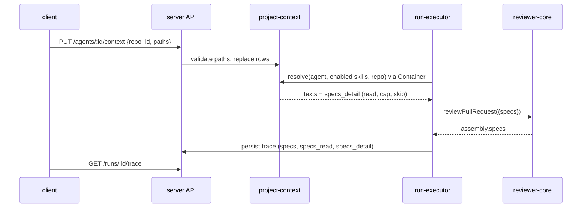

# Spec — Project Context (attach repo markdown docs to agents and skills)

Status: **approved** (amendment 2026-10-06: reindex, toolbar, grouped context; base spec implemented 2026-10-04, AC-3 deferred; re-approved 2026-10-06) · Scope: `server/` + `client/` + `reviewer-core/` (+ both `@devdigest/shared` copies) ·
Location: `specs/project-context.md`

## 1. Summary
Users pick markdown docs from an imported repo (`specs/`, `docs/`, `insights/`) and attach them, by hand, to an agent or a skill. When an agent runs on a PR of that repo, the server reads the attached files (the agent's own, then those of its enabled skills), and injects them as an UNTRUSTED `## Project context` block in the review prompt. The run drawer shows exactly what was injected. Token sizes are computed on the spot (no LLM call) so the user sees what each attachment costs. Docs are VIEW-ONLY. Automatic doc selection is a separate, later feature.

Amendment 2026-10-06 (mentor feedback): the page gets a toolbar (Reindex, Download, disabled Edit tab); Reindex triggers the existing repo resync so the clone is refreshed without a restart; the prompt block and the Context tabs' "SERIALIZES AS" view group docs by type (Specifications, Docs, Insights) so the UI shows exactly what the model receives.

| Surface | Where | What |
|---|---|---|
| Project Context page | sidebar WORKSPACE > Project Context | doc list + search, preview, "Used by N agents", footer totals; toolbar: Reindex, Download, disabled Edit tab (amendment) |
| Agent Context tab | `/agents/[id]` | repo selector, checkable/reorderable doc list, preview, token footer, grouped SERIALIZES AS view (amendment) |
| Skill Context tab | `/skills/[id]` | same, plus "any agent using this skill inherits these documents" |
| Run drawer (trace) | PR page > Agent runs | "Specs read" row + expandable "Project context — attached specs (untrusted)" |

## 2. Current state
- reviewer-core already accepts `specs?: string[]`, wraps each in `<untrusted source="spec-<i>">` and renders `## Project context` (`reviewer-core/src/prompt.ts:46,101-103,131`; passthrough `review/run.ts:62-63,140`). The system guard covers `<untrusted>` blocks (`prompt.ts:17-21`). The closing-tag escape is exact-case only (`prompt.ts:32`).
- The executor never passes `specs` (`server/src/modules/reviews/run-executor.ts:241-271`) and hardcodes `specs_read: []` (`:341`, `:519`) and `specs: null` on failure traces (`:515`).
- Trace contract has `prompt_assembly.specs: string|null` and `specs_read: string[]` only (`server/src/vendor/shared/contracts/trace.ts:43,93`). `getRunTrace` casts without parsing, so new trace fields must be `.nullish()` (`server/INSIGHTS.md`, 2026-09-16).
- Client trace already renders `specs_read` chips and a `PromptBlock` for `prompt_assembly.specs` when non-null (`client/src/app/repos/[repoId]/pulls/[number]/_components/RunTraceDrawer/_components/TraceBody/TraceBody.tsx:39-44,85-86`).
- Skills reach the prompt via `buildSkillBlocks` (best-effort, never fails the run, via `container.agentsRepo`; `run-executor.ts:388-404`); tokens via `container.tokenizer.count` (`:226,400`) — `js-tiktoken cl100k_base`, falls back to `ceil(chars/4)` (`server/src/adapters/tokenizer/index.ts:14-40`).
- Repos have `clone_path` (managed `git clone`; destination cleared on re-clone, `server/src/adapters/git/simple-git.ts:63`); null until cloned (`repo-intel/service.ts:146`). Reads use `readFile(join(clonePath, file))` with no containment check (`:762-763`).
- `agent_skills` has `order` and a per-agent `enabled`; a skill reaches the prompt only when both switches are on (`knowledge.ts:288-305`). `SkillSummary.used_by` is computed on read (`:134-137`).
- Client has no Project Context page, sidebar entry, or Context tab; agent editor has ConfigTab/SkillsTab, skill editor has Config/Preview/Versions.
- Missing everywhere: attachment storage, doc discovery, path guard, per-doc token data, trace per-doc detail. (Built since; see Status.)
- State at amendment (2026-10-06): there is no doc index or cache; `listDocs` walks the clone and reads every file on each call (`server/src/modules/project-context/service.ts:154-199`). The page "refresh" only calls `docs.refetch()` (`client/src/app/repos/[repoId]/context/_components/ContextView/ContextView.tsx:138`); nothing on the page can `git fetch`. No `POST /repos/:repoId/context/reindex` exists (`project-context/routes.ts:36-46`). `POST /repos/:id/resync` (202 + job id, git fetch + incremental reindex) exists in `repo-intel` (`repo-intel/routes.ts:43-65`, `service.ts:143-162`) and the client hook `useResyncRepoIntel` / `useRepoIntelStatus` exists (`client/src/lib/hooks/repo-intel.ts:31-49`), signalling completion by `lastIndexedSha`/`updatedAt` advancing.
- The prompt block is flat, in source order: `## Project context` then one `<untrusted source="<path>">` per doc (`reviewer-core/src/prompt.ts:106-113,140`); the type (`root_type`) is a UI badge only (`helpers.ts:25-31`, D13). The only description of the block is the text note `skillTab.serializes` (`client/messages/en/projectContext.json:65`, rendered at `client/src/app/skills/_components/SkillEditor/_components/ContextTab/ContextTab.tsx:19`). The page has no toolbar or tabs (`ContextView.tsx:106-115`).

## 3. Goals / Non-goals
Goals: (G1) browse repo docs; (G2) attach/reorder them on agents and skills per repo; (G3) show token cost before a run; (G4) inject them as untrusted context at run time; (G5) make the injected text and any skipped docs visible in the trace; (G6) refresh the clone and doc list from the page without a restart; (G7) show the model-facing grouping (Specifications, Docs, Insights) identically in the prompt and in the UI.
Non-goals (see §16): editing/creating/uploading docs, automatic selection, new skill/agent versions, coverage ring, per-repo glob overrides, Onboarding/Memory/Evals/CI/Stats tabs, downloading the serialized context (deferred), a persisted "last indexed" timestamp (U1 rejected). `git fetch` from the page is no longer a non-goal: it is done only through Reindex (D17).

## 4. Users & UX flow
Actor: a studio user configuring agents. Flow: open Project Context (sidebar) → pick a repo → search/preview docs → open Agent (or Skill) > Context → pick the repo → check docs, drag to reorder → read the "≈ N tokens" footer → run a review on a PR of that repo → open the run drawer → expand "Project context".

| State | Trigger | User sees |
|---|---|---|
| Loading | list/preview fetching | existing loading pattern of the page (no skeleton requirement) |
| Not cloned | repo `clone_path` null | empty state "Repo not cloned yet" |
| Empty | no `.md` under roots | empty state naming the roots |
| Truncated list | more than the list cap | notice "showing first N" |
| Missing attached doc | file gone after attach | row with "missing" badge, still checked, excluded from token sum |
| Over budget | summed tokens > total cap | warning in footer: later docs will be skipped |
| Error | API failure | inline error + retry; toggles revert to server state |
| Reindex idle | page open | Reindex button enabled |
| Reindex running | button pressed / job in flight | Reindex disabled with spinner; list unchanged until the job finishes |
| Reindex failed | request fails, degraded response, or poll limit reached | error toast; Reindex re-enabled; current list kept |
| No doc selected | nothing picked | Download disabled; Edit tab disabled |
| SERIALIZES AS (Context tab) | docs attached | grouped list Specifications / Docs / Insights, empty groups hidden, order numbers, per-group token subtotal |
| No project context in run | nothing attached/resolved | section and chips absent (today's behaviour) |

Design sources: images 1-4 (Project Context page, Agent Context tab, Skill Context tab, run drawer; not stored in the repo). Amendment 2026-10-06: mentor feedback text only; no prototype is on disk, so toolbar placement, copy and group headers are decided 2026-10-06 from mentor feedback (D16-D21).

## 5. Design analysis
**Gaps** (all closed by decisions/ACs unless marked): repo scope absent from design → D1; no empty/error/not-cloned states → §4; Edit/+new/upload toolbar → removed (D2; amended 2026-10-06: a disabled Edit tab is shown, D18); coverage ring → replaced by "Used by N" (D3); "SERIALIZES AS" box misdescribes the real injection → replaced (UX-P5); "last 5m ago" in footer has no data source → dropped; copy needs a new `client/messages/en/projectContext.json` namespace.
**Edge cases** moved to §10.
**Module interaction:** server owns discovery, path guard, tokens, "used by", attachments, group ordering; `reviews` consumes a resolver through the container (as `agentsRepo`); reviewer-core renders the group headings; client renders and sums for the footer. Amendment: the reindex route in `project-context` calls the repo-intel resync through the container, never importing the module (D12, D17).
**UX improvements:** P1 view-only — **accepted**. P2 up/down buttons — **not adopted** (drag reorder kept as designed; keyboard alternative resolved as M5, §15). P3 missing badge — **accepted**. P4 over-cap warning — **accepted**. P5 accurate block description — **accepted**. P6 skeleton — **not adopted**. U1 "last indexed at" next to Reindex — **rejected** (needs persisted state). U2 per-group token subtotal — **accepted**. U3 Reindex disabled while running — **accepted**.

## 6. Decisions
| # | Decision | Rationale | Source |
|---|---|---|---|
| D1 | Attachments keyed `(agent_id\|skill_id, repo_id, path, position)`; Context tabs and the page carry a repo selector; a run reads only the PR repo's attachments | exact token footer; UI and run agree | user Q1 = A |
| D2 | Docs are view-only; no endpoint writes doc content. Amended 2026-10-06: a disabled Edit tab is shown (D18) | `clone_path` is a managed cache clone, cleared on re-clone (`simple-git.ts:63`), nothing pushes back | user + code; mentor feedback |
| D3 | "Used by N agents" = distinct agents with a direct attachment OR linked (any link state) to a skill with the attachment, for that repo+path | user answer; no switch logic = simplest | user |
| D4 | Missing/unreadable doc at run time → skip, run continues, trace records it | user answer | user |
| D5 | Changing attachments creates no skill version and no agent version | user answer; simplest. Caveat: eval replays of an old agent version use today's attachments | user |
| D6 | Order: agent's docs by position, then each enabled skill (agent_skills order) by position; dedup by normalized path, first wins; trace records source | accepted default | user |
| D7 | Docs read from the clone's working tree (default-branch snapshot, not PR head) | clone only holds the default branch | accepted default |
| D8 | Roots: constant root-folder names `specs`, `docs`, `insights` (equivalent to `**/{specs,docs,insights}/**/*.md`); configurable setting deferred; no per-repo override | planning decision 2026-10-03 (no glob dependency) | user |
| D9 | No persisted index: the list endpoint walks the clone on each call; "refresh" = re-list. Amended 2026-10-06: the clone is brought up to date only by Reindex (D17); the list itself still never fetches | simplest | proposal accepted by default; mentor feedback |
| D10 | Tokens via `container.tokenizer` (same as run logs) so UI estimate == run estimate; shown as "≈" | R2 | R2 + code |
| D11 | Attachments in two tables (`agent_context_docs`, `skill_context_docs`) with real FKs, cascade delete, unique `(owner, repo_id, path)`, explicit `ORDER BY position` | mirrors `agent_skills`; list needs explicit order (`server/INSIGHTS.md` 2026-09-21) | code |
| D12 | New server module `src/modules/project-context/`; `reviews` receives a resolver via the Container, never imports the module | onion rule; `agentsRepo` precedent (`run-executor.ts:49`) | code |
| D13 | Doc type badge = nearest enclosing path segment among `specs`/`docs`/`insights`; "docs" if none | glob can match nested dirs | proposal |
| D14 | Page route `/repos/[repoId]/context`, repo from URL (like `repos/[repoId]/conventions`) | existing pattern | code |
| D15 | Defaults: per-doc cap 4000 tokens (truncate keeping head + `[truncated]` marker), total cap 10000 tokens, add in order and stop at budget | R2 (thin sourcing) | R2 — see M2 |
| D16 | The prompt groups docs by type in a fixed order: `### Specifications` (`specs`), `### Docs` (`docs`), `### Insights` (`insights`), under the single `## Project context` heading. Within a group, D6 order holds (agent docs by position, then each enabled skill's). Group = D13 rule (first matching root segment). Headings are trusted constants; group headers in the UI read "Specifications / Docs / Insights"; empty groups are omitted. The token budget (D15) is applied in this grouped order | the UI must show what the model receives; flat source order carried no type information | user Q1 = A (2026-10-06) |
| D17 | Reindex = new `POST /repos/:repoId/context/reindex`, which triggers the existing repo-intel resync (git fetch + incremental reindex) through the container and answers 202 + job id; a click while a resync job for the repo is queued or running returns that job's id; the client re-lists docs when the job finishes | without a fetch the clone, hence the list, can never change in-app | user Q2 = B, Q7 default (2026-10-06) |
| D18 | Page toolbar (above the doc preview): Reindex, Download, and an Edit tab beside Preview that is disabled with tooltip "Docs are edited in the repo". Reindex states: idle, running (disabled + spinner), error toast. Decided 2026-10-06 from mentor feedback (no prototype on disk) | matches the prototype described by the mentor while keeping D2 | user Q4 = A |
| D19 | Download saves the selected doc as `<basename>.md`, built client-side from the content already fetched; no endpoint. Serialized-context download is deferred | no agent is in scope on the repo-scoped page | user Q3 = A |
| D20 | The grouped SERIALIZES AS view lives on the agent and skill Context tabs, replacing the text note: a list of paths and tokens under group headers, with order numbers and a per-group token subtotal. It lists the owner's own attached docs; a one-line note says the agent's skills' docs follow within each group. Decided 2026-10-06 from mentor feedback | the page has no attachment concept; the tab has the order | Q5 default, U2 accepted |
| D21 | `SpecDetail` gains `root_type` (nullish) so the trace can show the group; traces without it render as today | old traces keep rendering (NFR-6) | user Q1 |

## 7. Data model & contracts
- **DB** (`server/src/db/schema/`, new file; generated migration only): `agent_context_docs(id, agent_id FK cascade, repo_id FK cascade, path, position, created_at)` and `skill_context_docs(…skill_id…)`; unique `(owner_id, repo_id, path)`; paths stored repo-relative, never content. No backfill (new tables).
- **Shared contracts** (new `contracts/project-context.ts`, identical in `server/src/vendor/shared` and `client/src/vendor/shared`, exported via the barrel; snake_case):
  - `ContextDoc {path, root_type: 'specs'|'docs'|'insights', size_bytes, tokens, used_by}`
  - `ContextDocList {docs, total_files, total_tokens, truncated, reason: 'not_cloned'|null, limits: {per_doc_tokens, total_tokens}}`
  - `ContextDocContent {path, content, tokens}`
  - `ContextAttachment {path, position, status: 'ok'|'missing', tokens}`; `ContextAttachmentList {repo_id, attachments, limits}`; PUT body `{repo_id, paths: string[]}` (ordered; replaces the set for that owner+repo).
  - Trace: `SpecDetail {path, tokens, source: 'agent'|'skill', source_name: string|null, status: 'read'|'truncated'|'missing'|'unreadable'|'over_budget'}`; `RunTrace.specs_detail: z.array(SpecDetail).nullish()`. `specs_read` stays `string[]` (read + truncated paths only).
- **Endpoints (proposed):** `GET /repos/:repoId/context/docs`, `GET /repos/:repoId/context/docs/content?path=`, `GET|PUT /agents/:id/context`, `GET|PUT /skills/:id/context`. Zod `schema.querystring/body` failures answer 422, so routes promising 400 must `safeParse` locally (`server/INSIGHTS.md` 2026-10-01).
- **reviewer-core:** `specs` entries gain an optional label (`string | {source, text}`), so existing string callers and tests keep working.
- **Amendment 2026-10-06:** `SpecDetail.root_type: 'specs'|'docs'|'insights'` as `.nullish()` in both shared copies (D21); reviewer-core `specs` object entries gain an optional `group` (`'specs'|'docs'|'insights'`) from which `assemblePrompt` emits the `###` headings; a string entry or an entry without `group` renders as today (flat). New endpoint `POST /repos/:repoId/context/reindex` → 202 `{status: 'accepted', jobId}` or `{status: 'accepted', degraded: true, reason}` (same shape as `repo-intel/routes.ts:60-63`); no body, no DB change, no migration.

## 8. Inputs & provenance
| Input | Source | Trust | When absent or degraded | Cap / budget |
|---|---|---|---|---|
| Doc text | clone working tree, `readDoc` (`service.ts:103-131`) | untrusted | missing/unreadable → skipped, recorded (AC-19) | 64 KB read; 4000 tokens/doc; 10000 tokens total, in grouped order (D16), via `container.tokenizer` |
| Attachments | `agent_context_docs` / `skill_context_docs` | trusted (user-set paths, re-validated) | none → block omitted (AC-23) | list cap 500 |
| Group headings | constants in reviewer-core (D16) | trusted | n/a | not counted against the doc caps |
| Group of a doc | path via `rootTypeOf` (`helpers.ts:25-31`) | derived from untrusted path | no root match → `docs` | n/a |
| Reindex trigger | `POST /repos/:repoId/context/reindex` → repo-intel resync job | trusted (workspace-scoped) | enqueue fails → degraded 202 (AC-47) | one job per repo at a time (AC-45) |
| Reindex completion | repo-intel `index-state` poll (`client/src/lib/hooks/repo-intel.ts:26-38`) | trusted | never advances → poll limit (constant in `client/`) then error toast (AC-50) | poll limit in a constant |
| Mentor feedback 2026-10-06 | user | n/a | no prototype on disk; copy/placement decided from the feedback | n/a |

## 9. Module interaction

Failure propagation: doc read/resolve failures never fail a run (logged + recorded in the trace); API validation failures return 4xx to the client, which restores server state.
Amendment: Reindex — client `POST /repos/:repoId/context/reindex` → `project-context` route (workspace check) → container-owned repo-intel facade enqueues/dedupes the resync job → 202 + job id; the client polls `index-state` and, when it advances, re-fetches the doc list. Enqueue failure is a degraded 202 and never a 5xx. Grouping: the run-executor orders resolved docs by group, reviewer-core renders headings from the `group` it is given.

## 10. Edge cases
| # | Case | Expected behaviour | AC-ID |
|---|---|---|---|
| E1 | 10k docs | list capped at 500 with `truncated`, also after Reindex | AC-5 |
| E2 | Huge/binary/empty file | head cut at 64 KB; binary → `unreadable`; run continues | AC-19, AC-20 |
| E3 | Duplicate basenames | full relative path shown and used as the key | AC-1 |
| E4 | Symlink escape | `invalid_path` | AC-9 |
| E5 | Doc attached to agent and its skill | dedup by path, agent wins | AC-17 |
| E6 | Clone refreshed mid-run (also by Reindex) | run reads the tree as it is per read; trace records what was read (D7) | AC-24 |
| E7 | Deleted skill/agent/repo | attachments cascade-deleted | AC-15 |
| E8 | Map-reduce re-sends the block per file call | tokens shown are per call | out of scope — §16 |
| E9 | Reindex pressed twice / from two tabs | the running job's id is returned, no second job | AC-45 |
| E10 | Reindex on an unknown or foreign repo | 404 | AC-46 |
| E11 | Reindex on a not-cloned repo or fetch failure | job degrades; client error toast, list kept | AC-47, AC-50 |
| E12 | Job never finishes / index state never advances | client stops at the poll limit, error toast, Reindex re-enabled | AC-50 |
| E13 | Clone cleared during re-clone | list answers `not_cloned`; page shows the not-cloned state | AC-4, AC-33 |
| E14 | Download with no doc, unreadable doc or content still loading | Download disabled | AC-52 |
| E15 | Doc basename with unsafe characters | download filename keeps only the basename, not the path | AC-51 |
| E16 | Doc under several roots (`docs/specs/x.md`) | goes to the first matching segment's group (D13) | AC-54 |
| E17 | An empty group | heading omitted in the prompt and in the UI | AC-54, AC-59 |
| E18 | Doc text or path imitating a heading (`### Docs`, `</untrusted>`) | headings come only from constants; text stays inside the untrusted wrapper; closing tags neutralised | AC-26, AC-56 |
| E19 | Over budget with grouping | docs are added in grouped order; later docs become `over_budget` | AC-21, AC-55 |
| E20 | Old trace without `root_type` | renders ungrouped as today | AC-58 |
| E21 | Missing doc in the SERIALIZES AS view | excluded from the list and subtotals (badge stays on the picker row) | AC-62 |
| E22 | Agent has skills with docs | view lists the owner's docs and a note that skill docs follow in each group | AC-59 |

## 11. Acceptance criteria (EARS)
| ID | Pattern | Requirement | Cat |
|---|---|---|---|
| AC-1 | Event | When the client requests a repo's docs, the API shall return each `.md` file matching the configured roots with `path`, `root_type`, `size_bytes`, `tokens` and `used_by`, sorted by path. | C3 |
| AC-2 | Ubiquitous | The API shall list every `.md` file that has a path segment equal to one of the constant roots `specs`, `docs`, `insights` (equivalent to `**/{specs,docs,insights}/**/*.md`). | C1 |
| AC-3 | — | **Deferred** (2026-10-03): configurable roots/glob setting moved to a later feature; roots are a constant in `constants.ts`. | C3 |
| AC-4 | Unwanted | If the repo has no `clone_path`, then the API shall return an empty list with `reason: "not_cloned"`. | C5 |
| AC-5 | Unwanted | If more than the list cap of files match, then the API shall return the first cap entries by path with `truncated: true`. | C5 |
| AC-6 | Event | When content for a path is requested, the API shall return its text and token count. | C3 |
| AC-7 | Ubiquitous | The API shall expose no endpoint that writes doc content to the repo clone; the reindex route only triggers the repo-intel resync job (amended 2026-10-06). | C1 |
| AC-8 | Unwanted | If a requested or attached path is absolute, contains `..`, is not `.md`, or is outside the configured roots, then the API shall respond 400 `invalid_path`. | C6 |
| AC-9 | Unwanted | If a path's real location (after symlink resolution) lies outside the clone root, then the API shall treat it as `invalid_path`. | C6 |
| AC-10 | Unwanted | If the requested file does not exist, then the content endpoint shall respond 404. | C5 |
| AC-11 | Event | When the client PUTs ordered paths for an agent and repo, the API shall replace that agent's attachments for the repo and return the stored order. | C3 |
| AC-12 | Event | When the client PUTs ordered paths for a skill and repo, the API shall replace that skill's attachments for the repo and shall not change the skill's version. | C3 |
| AC-13 | Ubiquitous | The API shall not change an agent's `version` when its attachments change. | C3 |
| AC-14 | Unwanted | If the paths contain a duplicate or an invalid entry, then the API shall reject the whole request and keep the stored attachments. | C5 |
| AC-15 | Unwanted | If the agent, skill or repo is outside the caller's workspace, then the API shall respond 404. When an agent, skill or repo is deleted, the API shall delete its attachment rows. | C5 |
| AC-16 | Event | When an attachment list is requested, the API shall return each path with `position`, `tokens` and `status` `ok` or `missing`. | C3 |
| AC-17 | Event | When an agent run starts on a PR, the run executor shall resolve the agent's attachments for the PR repo, then those of each enabled skill, deduplicated by normalized path (first occurrence wins). | C4 |
| AC-18 | Event | When resolved docs exist, the run executor shall pass them to the reviewer engine as `specs` with their group, so the prompt contains one `## Project context` block with each doc in its own untrusted wrapper labelled by path, under its group heading (AC-54). Amended 2026-10-06. | C4 |
| AC-19 | Unwanted | If an attached file is missing or unreadable at run time, then the run executor shall skip it, log an info line, record it in `specs_detail` as `missing`/`unreadable`, and continue the run. | C5 |
| AC-20 | Unwanted | If a doc exceeds the per-doc token cap, then the run executor shall keep its head, append a `[truncated]` marker, and record `truncated`. | C5 |
| AC-21 | Unwanted | If adding a doc would exceed the total token cap, then the run executor shall stop adding docs and record the remainder as `over_budget`. | C5 |
| AC-22 | Unwanted | If resolving project context throws, then the run executor shall run the review without it and log the error. | C5 |
| AC-23 | Ubiquitous | Where an agent has no resolved docs for the PR repo, the reviewer engine shall omit the `## Project context` section (and all group headings) so the prompt equals the one built without project context. Amended 2026-10-06. | C1 |
| AC-24 | Event | When a run completes, the run executor shall persist `prompt_assembly.specs` (with the group headings as sent), `specs_read` (read and truncated paths) and `specs_detail` (with `root_type`), in prompt order, in the trace. Amended 2026-10-06. | C3 |
| AC-25 | Ubiquitous | The reviewer engine shall build each spec's `source` attribute only from `[A-Za-z0-9._/-]` characters, capped at 200 characters. | C6 |
| AC-26 | Ubiquitous | The reviewer engine shall neutralize a closing `</untrusted>` tag in untrusted text case-insensitively and with inner whitespace. | C6 |
| AC-27 | Ubiquitous | The shared contracts in `server/` and `client/` shall be identical for every new schema and `specs_detail` shall be nullish. | C3 |
| AC-28 | Event | When the Project Context page opens, the client shall list the repo's docs with search by path, and a footer "Indexed: N files · N tokens total". | C2 |
| AC-29 | Event | When a doc is selected, the client shall show its rendered markdown and "Used by N agents". | C2 |
| AC-30 | Ubiquitous | The client shall render doc previews without executing or rendering raw HTML. | C6 |
| AC-31 | Ubiquitous | The client shall show no enabled Edit control, "+ new" or upload action on the Project Context page (amended 2026-10-06: the disabled Edit tab of AC-53 is the only Edit element). | C1 |
| AC-32 | Event | When the user presses the list refresh icon, the client shall re-fetch the doc list. | C2 |
| AC-33 | Unwanted | If the list is empty, not cloned, truncated or fails to load, then the client shall show the matching state from §4. | C2 |
| AC-34 | Event | When the Agent Context tab opens, the client shall show a repo selector and that repo's docs as rows (drag handle, checkbox, filename, folder, type badge, Preview), with "k of n attached". | C2 |
| AC-35 | Event | When the user toggles or drags a doc, the client shall PUT the new ordered list for the selected repo. | C2 |
| AC-36 | Unwanted | If the PUT fails, then the client shall show an error and restore the server order. | C5 |
| AC-37 | State | While docs are attached, the client shall show "≈ N tokens" in the footer, computed from the per-doc `tokens` capped at the per-doc limit. | C2 |
| AC-38 | Unwanted | If the summed tokens exceed the total cap, then the client shall show a footer warning that later docs will be skipped. | C5 |
| AC-39 | State | While an attached doc is missing, the client shall show a "missing" badge on its row and exclude it from the token sum. | C2 |
| AC-40 | Event | When the Skill Context tab opens, the client shall show the same controls plus "Any agent using this skill inherits these documents" and the grouped view of AC-59 instead of the text note. | C2 |
| AC-41 | Event | When the run drawer opens a trace with project context, the client shall show the Specs read row (missing/skipped docs flagged, with token sizes) and an expandable, copyable section "Project context — attached specs (untrusted)" with the full injected text. | C2 |
| AC-42 | Where | Where a trace has no `specs_detail` or `specs`, the client shall render the drawer as today. | C5 |
| AC-43 | Ubiquitous | The client shall list Project Context under WORKSPACE in the sidebar. | C2 |
| AC-44 | Event | When the client POSTs `/repos/:repoId/context/reindex` for a repo in the caller's workspace, the API shall enqueue the repo-intel resync job through the container and respond 202 with the job id. | C4 |
| AC-45 | Unwanted | If a resync job for the repo is already queued or running, then the API shall respond 202 with that job's id and shall not enqueue another. | C5 |
| AC-46 | Unwanted | If the repo does not exist or is outside the caller's workspace, then the API shall respond 404 and enqueue nothing. | C5 |
| AC-47 | Unwanted | If the job cannot be enqueued, then the API shall respond 202 with `degraded: true` and a `reason`. | C5 |
| AC-48 | Event | When the user presses Reindex, the client shall call the reindex route and show Reindex disabled with a spinner until the job finishes. | C2 |
| AC-49 | Event | When the reindex job finishes, the client shall re-fetch the doc list. | C2 |
| AC-50 | Unwanted | If the reindex request fails, the response is degraded, or the job does not finish within the poll limit, then the client shall show an error toast, re-enable Reindex and keep the current list. | C5 |
| AC-51 | Event | When the user presses Download with a doc selected, the client shall save the already-fetched content as `<basename>.md`. | C2 |
| AC-52 | Unwanted | If no doc is selected or its content is loading or failed, then the client shall disable Download. | C5 |
| AC-53 | Ubiquitous | The client shall show an Edit tab, disabled, next to Preview with the tooltip "Docs are edited in the repo". | C2 |
| AC-54 | Ubiquitous | The reviewer engine shall render the `## Project context` docs under `### Specifications`, `### Docs`, `### Insights`, in that order, and only for groups holding at least one doc. | C4 |
| AC-55 | Ubiquitous | The run executor shall order resolved docs by group (specs, docs, insights), then within a group agent docs by position followed by each enabled skill's docs, before applying the token budget. | C4 |
| AC-56 | Ubiquitous | The reviewer engine shall take group headings only from constants, never from doc text or paths. | C6 |
| AC-57 | Ubiquitous | The run executor shall record `root_type` on each `specs_detail` entry. | C3 |
| AC-58 | Where | Where a trace's `specs_detail` has no `root_type`, the client shall render the Specs read row ungrouped as today. | C5 |
| AC-59 | State | While docs are attached, the Agent and Skill Context tabs shall show SERIALIZES AS as a list grouped under "Specifications", "Docs", "Insights" (empty groups hidden), each doc with order number, path and tokens, each group with a token subtotal, and the note that the agent's skills' docs follow in each group. | C2 |
| AC-60 | Event | When the user toggles or reorders a doc, the client shall update the SERIALIZES AS view without a page reload. | C2 |
| AC-61 | State | While no docs are attached, the client shall hide the SERIALIZES AS view. | C2 |
| AC-62 | Ubiquitous | The client shall exclude missing docs from the SERIALIZES AS list and subtotals. | C2 |

## 12. Non-functional requirements
| ID | Requirement | Measure / threshold |
|---|---|---|
| NFR-1 | Adding project context shall make no extra LLM call. | 0 added provider calls per run |
| NFR-2 | The API shall count tokens with `container.tokenizer`, the counter the run uses. | same function in list, Context tab footer and run log |
| NFR-3 | The run executor shall log only path, source and token counts for docs, never their text. | grep of run logs: 0 doc text |
| NFR-4 | Caps (per-doc tokens, total tokens, list size, max bytes read per file) shall live in the module's `constants.ts`. | M2 for values |
| NFR-5 | Doc-list latency shall be measured before a budget is fixed. | measure first (M4); no token cache in MVP unless measurement demands it |
| NFR-6 | Traces persisted before this feature shall keep rendering. | old fixture renders with no error |
| NFR-7 | The Context tabs shall be keyboard-usable for reorder. | arrow-button reorder reusing the SkillsTab pattern (M5) |
| NFR-8 | Reindex shall add no LLM call and shall make the 202 response without waiting for the fetch. | 0 provider calls; response before the job runs |
| NFR-9 | The group headings shall not count against the 4000/10000 token caps, and the footer estimate shall stay labelled "≈". | heading text is a fixed constant of a few tokens |
| NFR-10 | The disabled Edit tab and Reindex spinner shall be exposed to assistive technology. | `aria-disabled` on Edit; Reindex label unchanged while busy |

## 13. Traceability
| Req | Goal / Decision | Module(s) | Likely files/areas | Verification |
|---|---|---|---|---|
| AC-1..10 | G1, D2, D8, D9, D13 | server | `modules/project-context/{routes,service,helpers,constants}.ts` | unit (glob, path guard, symlink) |
| AC-11..16 | G2, D1, D5, D11 | server | `db/schema/`, `project-context/repository` | `*.it.test.ts` |
| AC-17..24 | G4, G5, D4-D7, D12, D15 | server | `reviews/run-executor.ts`, `platform/container.ts`, `platform/trace-builder.ts` | unit + `*.it.test.ts` (like `skills-prompt.it.test.ts`) |
| AC-25..26 | G4 | reviewer-core | `src/prompt.ts` | unit (`reviewer-core/test/prompt.test.ts`) |
| AC-27 | G5 | shared copies | `vendor/shared/contracts/` | `diff` of the two copies + `server/test/contracts.test.ts` |
| AC-28..33, AC-43 | G1, D2, D14 | client | `app/repos/[repoId]/context/`, sidebar, `messages/en/projectContext.json` | RTL |
| AC-34..40 | G2, G3, UX-P3/4/5 | client | agent and skill editor Context tabs | RTL |
| AC-41..42 | G5 | client | `RunTraceDrawer/.../TraceBody` | RTL (extend `RunTraceDrawer.test.tsx`) |
| NFR-1..7 | G3, G4 | all | see above | unit / manual |
| AC-44..47 | G6, D17 | server | `project-context/routes.ts`, `service.ts`, `platform/container.ts`, repo-intel facade | unit (route, mocked jobs); `*.it.test.ts` for dedupe if the jobs table is used |
| AC-48..50, AC-53 | G6, D17, D18 | client | `repos/[repoId]/context/_components/ContextView`, `lib/hooks/project-context.ts`, `messages/en/projectContext.json` | RTL |
| AC-51..52 | D19 | client | `ContextView`, `helpers.ts` | RTL |
| AC-54, AC-56 | G7, D16 | reviewer-core | `src/prompt.ts` | unit (`reviewer-core/test/prompt.test.ts`) |
| AC-55, AC-57 | G7, D16, D21 | server | `project-context/{service,helpers}.ts`, `reviews/run-executor.ts`, `vendor/shared/contracts/{project-context,trace}.ts` (both copies) | unit |
| AC-58 | D21 | client | `TraceBody` | RTL (old fixture) |
| AC-59..62 | G7, D20 | client | `components/context-doc-picker/`, skill and agent `ContextTab` | RTL |
| NFR-8..10 | G6, D16, D18 | server, client | see above | unit / RTL |

## 14. Verification hints
- server: `pnpm test` (hermetic: helpers, path guard, caps, dedup, token sums) and `pnpm exec vitest run .it.test` (attachments, cascade, trace persistence; needs Docker). reviewer-core: `pnpm test`. client: `pnpm test` (RTL). Tests named `it('AC-n: …')`.
- Final invariant check from the brief ("`api/` must not import `db/` directly"; violating PR; reviewer cites the doc) needs a real LLM: manual, not e2e. A deterministic e2e flow (attach → run drawer shows block with a mocked LLM) is optional, not required for MVP (M7).

## 15. Open questions
None open (0 `[NEEDS CLARIFICATION]`). Amendment 2026-10-06: Q1-Q4 answered by the user, Q5 and Q7 by recommended default, Q6 reopening authorised; copy and placement decided from mentor feedback. Planner notes (not open questions): confirm how the jobs API exposes a queued or running job for AC-45, and that `index-state` advances when a resync finds no new commits for AC-49/AC-50 (otherwise the poll limit applies).
Resolved earlier — all minor markers resolved 2026-10-03, user accepted the recommended defaults:
- **M1** — roots/glob setting lives in the existing settings module (no contract change).
- **M2** — caps: per-doc 4000 tokens, total 10000 tokens, list cap 500 files, max 64 KB read per file (constants in `constants.ts`).
- **M3** — per-request nonce and role-marker neutralization deferred (R1: SHOULD); attribute sanitization (AC-25) stays MUST.
- **M4** — latency: measure first; no fixed budget in MVP.
- **M5** — keyboard reorder via arrow buttons, reusing the SkillsTab pattern.
- **M6** — Context tabs' repo selector defaults to the repo from current context, else the first repo.
- **M7** — sidebar entry under WORKSPACE as in the design; e2e flow optional, not required for MVP.

## 16. Out of scope
Editing, creating, uploading docs (rejected: view-only, P1 accepted; the Edit tab stays disabled); "last indexed at" timestamp (U1, rejected by user 2026-10-06); downloading the serialized context or a bundle of docs (deferred); map-reduce per-call re-sending of the block; coverage ring; automatic doc selection from PR content; skill/agent versioning of attachments; per-repo glob overrides; `git fetch` outside Reindex; indexing/chunking/embeddings; Onboarding Tour, Memory, Evals, CI, Stats tabs; UX proposals P2 (up/down buttons) and P6 (skeleton) — not adopted by user; datamarking/base64 encoding of docs (R1: hurts fidelity).

## 17. Changelog
| Date | Change | Reason / source |
|---|---|---|
| 2026-10-03 | Initial draft | Pass 2: user answers (Q1=A, P1/P3/P4/P5 accepted), R1, R2, code grounding |
| 2026-10-03 | M1–M7 resolved with recommended defaults; status → approved | User decision |
| 2026-10-03 | AC-3 deferred, AC-2/D8 reworded to constant roots; planner minor assumptions accepted (footer totals, over_budget tokens, arrow reorder in scope, IGNORE_DIRS, binary → unreadable, empty PUT clears, no rate limit); nav.ts edit approved for AC-43 | Implementation planning, user decision |
| 2026-10-04 | Status → implemented (all ACs verified except deferred AC-3). Behavior as built: symlink escape and duplicate PUT paths answer 400 `invalid_path`; per-doc skip info log; `[truncated]` marker counted inside the per-doc cap; validation runs before `getContext`; one container-owned `ProjectContextService`. Server reference: [server/docs/project-context.md](../server/docs/project-context.md) | Implementation + follow-up fixes (commit 561e83e + uncommitted) |
| 2026-10-06 | Amendment: Reindex route + toolbar (Reindex, Download, disabled Edit tab), prompt and SERIALIZES AS grouped by type (Specifications / Docs / Insights); AC-44..62, NFR-8..10; D2/D9/AC-7/AC-18/AC-23/AC-24 amended; restructured to the new template (§8 Inputs & provenance, §10 Edge cases), sections renumbered; status → clarified | Mentor feedback; user answers Q1–Q4, defaults Q5–Q7 |
