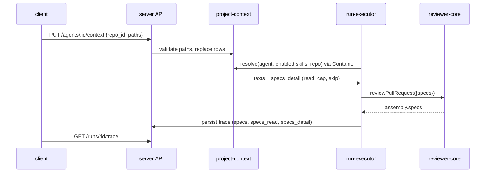

# Spec — Project Context (attach repo markdown docs to agents and skills)

Status: **approved** (2026-10-03) · Scope: `server/` + `client/` + `reviewer-core/` (+ both `@devdigest/shared` copies) ·
Location: `specs/project-context.md`

## 1. Summary
Users pick markdown docs from an imported repo (`specs/`, `docs/`, `insights/`) and attach them, by hand, to an agent or a skill. When an agent runs on a PR of that repo, the server reads the attached files (the agent's own, then those of its enabled skills), and injects them as an UNTRUSTED `## Project context` block in the review prompt. The run drawer shows exactly what was injected. Token sizes are computed on the spot (no LLM call) so the user sees what each attachment costs. Docs are VIEW-ONLY. Automatic doc selection is a separate, later feature.

| Surface | Where | What |
|---|---|---|
| Project Context page | sidebar WORKSPACE > Project Context | doc list + search, preview, "Used by N agents", footer totals |
| Agent Context tab | `/agents/[id]` | repo selector, checkable/reorderable doc list, preview, token footer |
| Skill Context tab | `/skills/[id]` | same, plus "any agent using this skill inherits these documents" |
| Run drawer (trace) | PR page > Agent runs | "Specs read" row + expandable "Project context — attached specs (untrusted)" |

## 2. Current state
- reviewer-core already accepts `specs?: string[]`, wraps each in `<untrusted source="spec-<i>">` and renders `## Project context` (`reviewer-core/src/prompt.ts:46,101-103,131`; passthrough `review/run.ts:62-63,140`). The system guard covers `<untrusted>` blocks (`prompt.ts:17-21`). The closing-tag escape is exact-case only (`prompt.ts:32`).
- The executor never passes `specs` (`server/src/modules/reviews/run-executor.ts:241-271`) and hardcodes `specs_read: []` (`:341`, `:519`) and `specs: null` on failure traces (`:515`).
- Trace contract has `prompt_assembly.specs: string|null` and `specs_read: string[]` only (`server/src/vendor/shared/contracts/trace.ts:43,93`). `getRunTrace` casts without parsing, so new trace fields must be `.nullish()` (`server/INSIGHTS.md`, 2026-09-16).
- Client trace already renders `specs_read` chips and a `PromptBlock` for `prompt_assembly.specs` when non-null (`client/src/app/repos/[repoId]/pulls/[number]/_components/RunTraceDrawer/_components/TraceBody/TraceBody.tsx:39-44,85-86`).
- Skills reach the prompt via `buildSkillBlocks` (best-effort, never fails the run, via `container.agentsRepo`; `run-executor.ts:388-404`); tokens via `container.tokenizer.count` (`:226,400`) — `js-tiktoken cl100k_base`, falls back to `ceil(chars/4)` (`server/src/adapters/tokenizer/index.ts:14-40`).
- Repos have `clone_path` (managed `git clone`; destination cleared on re-clone, `server/src/adapters/git/simple-git.ts:63`); null until cloned (`repo-intel/service.ts:146`). Reads use `readFile(join(clonePath, file))` with no containment check (`:762-763`).
- `agent_skills` has `order` and a per-agent `enabled`; a skill reaches the prompt only when both switches are on (`knowledge.ts:288-305`). `SkillSummary.used_by` is computed on read (`:134-137`).
- Client has no Project Context page, sidebar entry, or Context tab; agent editor has ConfigTab/SkillsTab, skill editor has Config/Preview/Versions.
- Missing everywhere: attachment storage, doc discovery, path guard, per-doc token data, trace per-doc detail.

## 3. Goals / Non-goals
Goals: (G1) browse repo docs; (G2) attach/reorder them on agents and skills per repo; (G3) show token cost before a run; (G4) inject them as untrusted context at run time; (G5) make the injected text and any skipped docs visible in the trace.
Non-goals (see §14): editing/creating/uploading docs, automatic selection, new skill/agent versions, coverage ring, per-repo glob overrides, Onboarding/Memory/Evals/CI/Stats tabs, `git fetch` from the page.

## 4. Users & UX flow
Actor: a studio user configuring agents. Flow: open Project Context (sidebar) → pick a repo → search/preview docs → open Agent (or Skill) > Context → pick the repo → check docs, drag to reorder → read the "≈ N tokens" footer → run a review on a PR of that repo → open the run drawer → expand "Project context".

| State | Trigger | User sees |
|---|---|---|
| Loading | list/preview fetching | existing loading pattern of the page (no skeleton requirement) |
| Not cloned | repo `clone_path` null | empty state "Repo not cloned yet" |
| Empty | no `.md` under roots | empty state naming the roots |
| Truncated list | more than the list cap | notice "showing first N" |
| Missing attached doc | file gone after attach | row with "missing" badge, still checked, excluded from token sum |
| Over budget | summed tokens > total cap | warning in footer: later docs will be skipped |
| Error | API failure | inline error + retry; toggles revert to server state |
| No project context in run | nothing attached/resolved | section and chips absent (today's behaviour) |

Design sources: images 1-4 (Project Context page, Agent Context tab, Skill Context tab, run drawer).

## 5. Design analysis
**Gaps** (all closed by decisions/ACs unless marked): repo scope absent from design → D1; no empty/error/not-cloned states → §4; Edit/+new/upload toolbar → removed (D2); coverage ring → replaced by "Used by N" (D3); "SERIALIZES AS" box misdescribes the real injection → replaced (UX-P5); "last 5m ago" in footer has no data source → dropped; copy needs a new `client/messages/en/projectContext.json` namespace.
**Uncovered edge cases:** 10k docs, huge/binary/empty files, duplicate basenames (full relative path shown), symlink escape, doc attached to both agent and its skill (D6), clone refreshed mid-run, deleted skill/agent/repo (cascade, AC-15), map-reduce re-sending the block per file call (tokens shown are per call).
**Module interaction:** server owns discovery, path guard, tokens, "used by", attachments; `reviews` consumes a resolver through the container (as `agentsRepo`); reviewer-core only renders; client renders and sums for the footer.
**UX improvements:** P1 view-only — **accepted**. P2 up/down buttons — **not adopted** (drag reorder kept as designed; keyboard alternative open as `:minor`, §13). P3 missing badge — **accepted**. P4 over-cap warning — **accepted**. P5 accurate block description — **accepted**. P6 skeleton — **not adopted**.

## 6. Decisions
| # | Decision | Rationale | Source |
|---|---|---|---|
| D1 | Attachments keyed `(agent_id\|skill_id, repo_id, path, position)`; Context tabs and the page carry a repo selector; a run reads only the PR repo's attachments | exact token footer; UI and run agree | user Q1 = A |
| D2 | Docs are view-only; no write endpoint | `clone_path` is a managed cache clone, cleared on re-clone (`simple-git.ts:63`), nothing pushes back | user + code |
| D3 | "Used by N agents" = distinct agents with a direct attachment OR linked (any link state) to a skill with the attachment, for that repo+path | user answer; no switch logic = simplest | user |
| D4 | Missing/unreadable doc at run time → skip, run continues, trace records it | user answer | user |
| D5 | Changing attachments creates no skill version and no agent version | user answer; simplest. Caveat: eval replays of an old agent version use today's attachments | user |
| D6 | Order: agent's docs by position, then each enabled skill (agent_skills order) by position; dedup by normalized path, first wins; trace records source | accepted default | user |
| D7 | Docs read from the clone's working tree (default-branch snapshot, not PR head) | clone only holds the default branch | accepted default |
| D8 | Roots: constant root-folder names `specs`, `docs`, `insights` (equivalent to `**/{specs,docs,insights}/**/*.md`); configurable setting deferred; no per-repo override | planning decision 2026-10-03 (no glob dependency) | user |
| D9 | No persisted index: the list endpoint walks the clone on each call; "refresh" = re-list (no `git fetch`) | simplest | proposal accepted by default |
| D10 | Tokens via `container.tokenizer` (same as run logs) so UI estimate == run estimate; shown as "≈" | R2 | R2 + code |
| D11 | Attachments in two tables (`agent_context_docs`, `skill_context_docs`) with real FKs, cascade delete, unique `(owner, repo_id, path)`, explicit `ORDER BY position` | mirrors `agent_skills`; list needs explicit order (`server/INSIGHTS.md` 2026-09-21) | code |
| D12 | New server module `src/modules/project-context/`; `reviews` receives a resolver via the Container, never imports the module | onion rule; `agentsRepo` precedent (`run-executor.ts:49`) | code |
| D13 | Doc type badge = nearest enclosing path segment among `specs`/`docs`/`insights`; "docs" if none | glob can match nested dirs | proposal |
| D14 | Page route `/repos/[repoId]/context`, repo from URL (like `repos/[repoId]/conventions`) | existing pattern | code |
| D15 | Defaults: per-doc cap 4000 tokens (truncate keeping head + `[truncated]` marker), total cap 10000 tokens, add in order and stop at budget | R2 (thin sourcing) | R2 — see M2 |

## 7. Data model & contracts
- **DB** (`server/src/db/schema/`, new file; generated migration only): `agent_context_docs(id, agent_id FK cascade, repo_id FK cascade, path, position, created_at)` and `skill_context_docs(…skill_id…)`; unique `(owner_id, repo_id, path)`; paths stored repo-relative, never content. No backfill (new tables).
- **Shared contracts** (new `contracts/project-context.ts`, identical in `server/src/vendor/shared` and `client/src/vendor/shared`, exported via the barrel; snake_case):
  - `ContextDoc {path, root_type: 'specs'|'docs'|'insights', size_bytes, tokens, used_by}`
  - `ContextDocList {docs, total_files, total_tokens, truncated, reason: 'not_cloned'|null, limits: {per_doc_tokens, total_tokens}}`
  - `ContextDocContent {path, content, tokens}`
  - `ContextAttachment {path, position, status: 'ok'|'missing', tokens}`; `ContextAttachmentList {repo_id, attachments, limits}`; PUT body `{repo_id, paths: string[]}` (ordered; replaces the set for that owner+repo).
  - Trace: `SpecDetail {path, tokens, source: 'agent'|'skill', source_name: string|null, status: 'read'|'truncated'|'missing'|'unreadable'|'over_budget'}`; `RunTrace.specs_detail: z.array(SpecDetail).nullish()`. `specs_read` stays `string[]` (read + truncated paths only).
- **Endpoints (proposed):** `GET /repos/:repoId/context/docs`, `GET /repos/:repoId/context/docs/content?path=`, `GET|PUT /agents/:id/context`, `GET|PUT /skills/:id/context`. Zod `schema.querystring/body` failures answer 422, so routes promising 400 must `safeParse` locally (`server/INSIGHTS.md` 2026-10-01).
- **reviewer-core:** `specs` entries gain an optional label (`string | {source, text}`), so existing string callers and tests keep working.

## 8. Module interaction

Failure propagation: doc read/resolve failures never fail a run (logged + recorded in the trace); API validation failures return 4xx to the client, which restores server state.

## 9. Acceptance criteria (EARS)
| ID | Pattern | Requirement | Cat |
|---|---|---|---|
| AC-1 | Event | When the client requests a repo's docs, the API shall return each `.md` file matching the configured roots with `path`, `root_type`, `size_bytes`, `tokens` and `used_by`, sorted by path. | C3 |
| AC-2 | Ubiquitous | The API shall list every `.md` file that has a path segment equal to one of the constant roots `specs`, `docs`, `insights` (equivalent to `**/{specs,docs,insights}/**/*.md`). | C1 |
| AC-3 | — | **Deferred** (2026-10-03): configurable roots/glob setting moved to a later feature; roots are a constant in `constants.ts`. | C3 |
| AC-4 | Unwanted | If the repo has no `clone_path`, then the API shall return an empty list with `reason: "not_cloned"`. | C5 |
| AC-5 | Unwanted | If more than the list cap of files match, then the API shall return the first cap entries by path with `truncated: true`. | C5 |
| AC-6 | Event | When content for a path is requested, the API shall return its text and token count. | C3 |
| AC-7 | Ubiquitous | The API shall expose no endpoint that writes to the repo clone. | C1 |
| AC-8 | Unwanted | If a requested or attached path is absolute, contains `..`, is not `.md`, or is outside the configured roots, then the API shall respond 400 `invalid_path`. | C6 |
| AC-9 | Unwanted | If a path's real location (after symlink resolution) lies outside the clone root, then the API shall treat it as `invalid_path`. | C6 |
| AC-10 | Unwanted | If the requested file does not exist, then the content endpoint shall respond 404. | C5 |
| AC-11 | Event | When the client PUTs ordered paths for an agent and repo, the API shall replace that agent's attachments for the repo and return the stored order. | C3 |
| AC-12 | Event | When the client PUTs ordered paths for a skill and repo, the API shall replace that skill's attachments for the repo and shall not change the skill's version. | C3 |
| AC-13 | Ubiquitous | The API shall not change an agent's `version` when its attachments change. | C3 |
| AC-14 | Unwanted | If the paths contain a duplicate or an invalid entry, then the API shall reject the whole request and keep the stored attachments. | C5 |
| AC-15 | Unwanted | If the agent, skill or repo is outside the caller's workspace, then the API shall respond 404. When an agent, skill or repo is deleted, the API shall delete its attachment rows. | C5 |
| AC-16 | Event | When an attachment list is requested, the API shall return each path with `position`, `tokens` and `status` `ok` or `missing`. | C3 |
| AC-17 | Event | When an agent run starts on a PR, the run executor shall resolve the agent's attachments for the PR repo, then those of each enabled skill, deduplicated by normalized path (first occurrence wins). | C4 |
| AC-18 | Event | When resolved docs exist, the run executor shall pass them to the reviewer engine as `specs`, so the prompt contains one `## Project context` block with each doc in its own untrusted wrapper labelled by path. | C4 |
| AC-19 | Unwanted | If an attached file is missing or unreadable at run time, then the run executor shall skip it, log an info line, record it in `specs_detail` as `missing`/`unreadable`, and continue the run. | C5 |
| AC-20 | Unwanted | If a doc exceeds the per-doc token cap, then the run executor shall keep its head, append a `[truncated]` marker, and record `truncated`. | C5 |
| AC-21 | Unwanted | If adding a doc would exceed the total token cap, then the run executor shall stop adding docs and record the remainder as `over_budget`. | C5 |
| AC-22 | Unwanted | If resolving project context throws, then the run executor shall run the review without it and log the error. | C5 |
| AC-23 | Ubiquitous | Where an agent has no resolved docs for the PR repo, the reviewer engine shall omit the `## Project context` section so the prompt equals today's. | C1 |
| AC-24 | Event | When a run completes, the run executor shall persist `prompt_assembly.specs`, `specs_read` (read and truncated paths) and `specs_detail` in the trace. | C3 |
| AC-25 | Ubiquitous | The reviewer engine shall build each spec's `source` attribute only from `[A-Za-z0-9._/-]` characters, capped at 200 characters. | C6 |
| AC-26 | Ubiquitous | The reviewer engine shall neutralize a closing `</untrusted>` tag in untrusted text case-insensitively and with inner whitespace. | C6 |
| AC-27 | Ubiquitous | The shared contracts in `server/` and `client/` shall be identical for every new schema and `specs_detail` shall be nullish. | C3 |
| AC-28 | Event | When the Project Context page opens, the client shall list the repo's docs with search by path, and a footer "Indexed: N files · N tokens total". | C2 |
| AC-29 | Event | When a doc is selected, the client shall show its rendered markdown and "Used by N agents". | C2 |
| AC-30 | Ubiquitous | The client shall render doc previews without executing or rendering raw HTML. | C6 |
| AC-31 | Ubiquitous | The client shall show no Edit toggle, "+ new" or upload action on the Project Context page. | C1 |
| AC-32 | Event | When the user presses refresh, the client shall re-fetch the doc list. | C2 |
| AC-33 | Unwanted | If the list is empty, not cloned, truncated or fails to load, then the client shall show the matching state from §4. | C2 |
| AC-34 | Event | When the Agent Context tab opens, the client shall show a repo selector and that repo's docs as rows (drag handle, checkbox, filename, folder, type badge, Preview), with "k of n attached". | C2 |
| AC-35 | Event | When the user toggles or drags a doc, the client shall PUT the new ordered list for the selected repo. | C2 |
| AC-36 | Unwanted | If the PUT fails, then the client shall show an error and restore the server order. | C5 |
| AC-37 | State | While docs are attached, the client shall show "≈ N tokens" in the footer, computed from the per-doc `tokens` capped at the per-doc limit. | C2 |
| AC-38 | Unwanted | If the summed tokens exceed the total cap, then the client shall show a footer warning that later docs will be skipped. | C5 |
| AC-39 | State | While an attached doc is missing, the client shall show a "missing" badge on its row and exclude it from the token sum. | C2 |
| AC-40 | Event | When the Skill Context tab opens, the client shall show the same controls plus "Any agent using this skill inherits these documents" and a description of the real `## Project context` block instead of "SERIALIZES AS". | C2 |
| AC-41 | Event | When the run drawer opens a trace with project context, the client shall show the Specs read row (missing/skipped docs flagged, with token sizes) and an expandable, copyable section "Project context — attached specs (untrusted)" with the full injected text. | C2 |
| AC-42 | Where | Where a trace has no `specs_detail` or `specs`, the client shall render the drawer as today. | C5 |
| AC-43 | Ubiquitous | The client shall list Project Context under WORKSPACE in the sidebar. | C2 |

## 10. Non-functional requirements
| ID | Requirement | Measure / threshold |
|---|---|---|
| NFR-1 | Adding project context shall make no extra LLM call. | 0 added provider calls per run |
| NFR-2 | The API shall count tokens with `container.tokenizer`, the counter the run uses. | same function in list, Context tab footer and run log |
| NFR-3 | The run executor shall log only path, source and token counts for docs, never their text. | grep of run logs: 0 doc text |
| NFR-4 | Caps (per-doc tokens, total tokens, list size, max bytes read per file) shall live in the module's `constants.ts`. | M2 for values |
| NFR-5 | Doc-list latency shall be measured before a budget is fixed. | measure first (M4); no token cache in MVP unless measurement demands it |
| NFR-6 | Traces persisted before this feature shall keep rendering. | old fixture renders with no error |
| NFR-7 | The Context tabs shall be keyboard-usable for reorder. | arrow-button reorder reusing the SkillsTab pattern (M5) |

## 11. Traceability
| Req | Goal / Decision | Module(s) | Likely files/areas | Verification |
|---|---|---|---|---|
| AC-1..10 | G1, D2, D8, D9, D13 | server | `modules/project-context/{routes,service,helpers,constants}.ts` | unit (glob, path guard, symlink) |
| AC-11..16 | G2, D1, D5, D11 | server | `db/schema/`, `project-context/repository` | `*.it.test.ts` |
| AC-17..24 | G4, G5, D4-D7, D12, D15 | server | `reviews/run-executor.ts`, `platform/container.ts`, `platform/trace-builder.ts` | unit + `*.it.test.ts` (like `skills-prompt.it.test.ts`) |
| AC-25..26 | G4 | reviewer-core | `src/prompt.ts` | unit (`reviewer-core/test/prompt.test.ts`) |
| AC-27 | G5 | shared copies | `vendor/shared/contracts/` | `diff` of the two copies + `server/test/contracts.test.ts` |
| AC-28..33, AC-43 | G1, D2, D14 | client | `app/repos/[repoId]/context/`, sidebar, `messages/en/projectContext.json` | RTL |
| AC-34..40 | G2, G3, UX-P3/4/5 | client | agent and skill editor Context tabs | RTL |
| AC-41..42 | G5 | client | `RunTraceDrawer/.../TraceBody` | RTL (extend `RunTraceDrawer.test.tsx`) |
| NFR-1..7 | G3, G4 | all | see above | unit / manual |

## 12. Verification hints
- server: `pnpm test` (hermetic: helpers, path guard, caps, dedup, token sums) and `pnpm exec vitest run .it.test` (attachments, cascade, trace persistence; needs Docker). reviewer-core: `pnpm test`. client: `pnpm test` (RTL). Tests named `it('AC-n: …')`.
- Final invariant check from the brief ("`api/` must not import `db/` directly"; violating PR; reviewer cites the doc) needs a real LLM: manual, not e2e. A deterministic e2e flow (attach → run drawer shows block with a mocked LLM) is optional, not required for MVP (M7).

## 13. Resolved questions
All minor markers resolved 2026-10-03 — user accepted the recommended defaults:
- **M1** — roots/glob setting lives in the existing settings module (no contract change).
- **M2** — caps: per-doc 4000 tokens, total 10000 tokens, list cap 500 files, max 64 KB read per file (constants in `constants.ts`).
- **M3** — per-request nonce and role-marker neutralization deferred (R1: SHOULD); attribute sanitization (AC-25) stays MUST.
- **M4** — latency: measure first; no fixed budget in MVP.
- **M5** — keyboard reorder via arrow buttons, reusing the SkillsTab pattern.
- **M6** — Context tabs' repo selector defaults to the repo from current context, else the first repo.
- **M7** — sidebar entry under WORKSPACE as in the design; e2e flow optional, not required for MVP.

## 14. Out of scope
Editing, creating, uploading docs (rejected: view-only, P1 accepted); coverage ring; automatic doc selection from PR content; skill/agent versioning of attachments; per-repo glob overrides; `git fetch` from the page; indexing/chunking/embeddings; Onboarding Tour, Memory, Evals, CI, Stats tabs; UX proposals P2 (up/down buttons) and P6 (skeleton) — not adopted by user; datamarking/base64 encoding of docs (R1: hurts fidelity).

## 15. Changelog
| Date | Change | Reason / source |
|---|---|---|
| 2026-10-03 | Initial draft | Pass 2: user answers (Q1=A, P1/P3/P4/P5 accepted), R1, R2, code grounding |
| 2026-10-03 | M1–M7 resolved with recommended defaults; status → approved | User decision |
| 2026-10-03 | AC-3 deferred, AC-2/D8 reworded to constant roots; planner minor assumptions accepted (footer totals, over_budget tokens, arrow reorder in scope, IGNORE_DIRS, binary → unreadable, empty PUT clears, no rate limit); nav.ts edit approved for AC-43 | Implementation planning, user decision |
